# Архитектура страницы карты MeTravel

> **Дата:** 6 февраля 2026  
> **Визуализация компонентов и их взаимодействия**

---

## Компонентная структура (текущая)

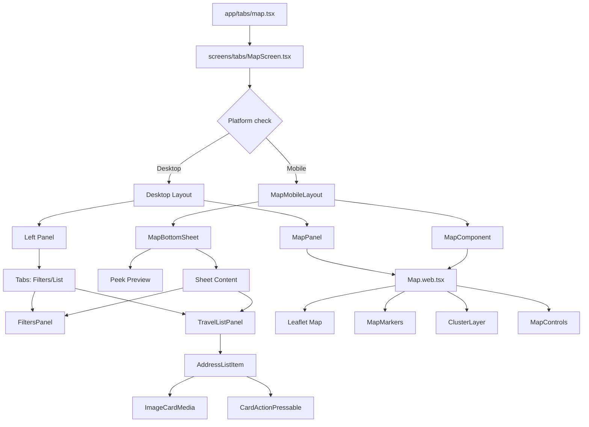
```mermaid
graph TD
    A[app/tabs/map.tsx] --> B[screens/tabs/MapScreen.tsx]
    B --> C{Platform check}
    
    C -->|Desktop| D[Desktop Layout]
    C -->|Mobile| E[MapMobileLayout]
    
    D --> F[Left Panel]
    D --> G[MapPanel]
    
    F --> H[Tabs: Filters/List]
    H --> I[FiltersPanel]
    H --> J[TravelListPanel]
    
    E --> K[MapComponent]
    E --> L[MapBottomSheet]
    
    L --> M[Peek Preview]
    L --> N[Sheet Content]
    N --> I
    N --> J
    
    G --> O[Map.web.tsx]
    K --> O
    
    O --> P[Leaflet Map]
    O --> Q[MapMarkers]
    O --> R[ClusterLayer]
    O --> S[MapControls]
    
    J --> T[AddressListItem]
    T --> U[ImageCardMedia]
    T --> V[CardActionPressable]
```

---

## Data Flow (состояние и контексты)

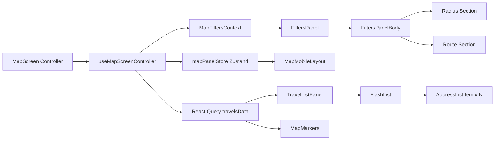
```mermaid
graph LR
    A[MapScreen Controller] --> B[useMapScreenController]
    B --> C[MapFiltersContext]
    B --> D[mapPanelStore Zustand]
    B --> E[React Query travelsData]
    
    C --> F[FiltersPanel]
    D --> G[MapMobileLayout]
    E --> H[TravelListPanel]
    E --> I[MapMarkers]
    
    F --> J[FiltersPanelBody]
    J --> K[Radius Section]
    J --> L[Route Section]
    
    H --> M[FlashList]
    M --> N[AddressListItem x N]
```

---

## User Journey — Radius Mode (текущий)

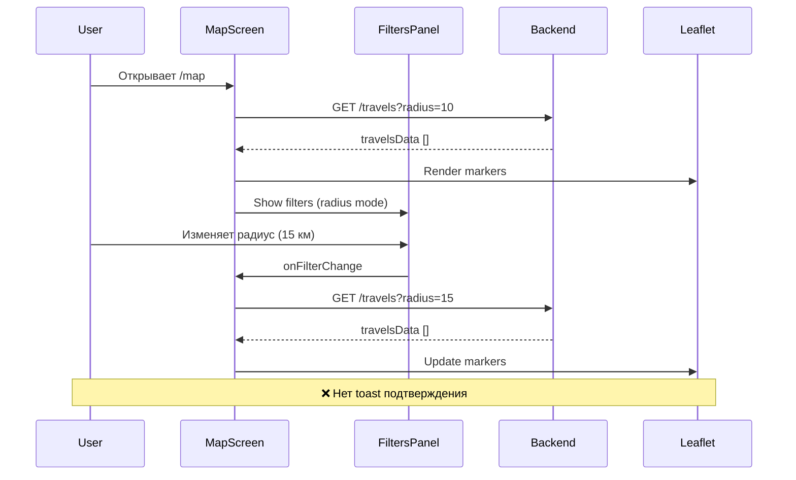
```mermaid
sequenceDiagram
    participant U as User
    participant M as MapScreen
    participant F as FiltersPanel
    participant API as Backend
    participant Map as Leaflet
    
    U->>M: Открывает /map
    M->>API: GET /travels?radius=10
    API-->>M: travelsData []
    M->>Map: Render markers
    M->>F: Show filters (radius mode)
    
    U->>F: Изменяет радиус (15 км)
    F->>M: onFilterChange
    M->>API: GET /travels?radius=15
    API-->>M: travelsData []
    M->>Map: Update markers
    
    Note over U,Map: ❌ Нет toast подтверждения
```

---

## User Journey — Route Mode (текущий)

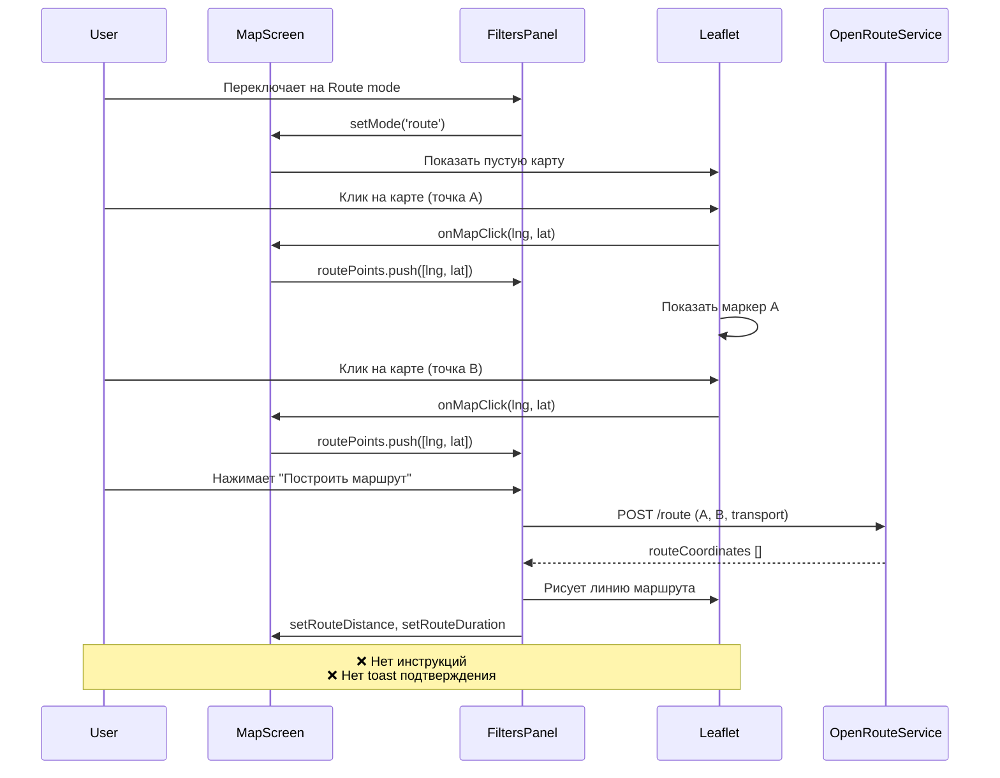
```mermaid
sequenceDiagram
    participant U as User
    participant M as MapScreen
    participant F as FiltersPanel
    participant Map as Leaflet
    participant ORS as OpenRouteService
    
    U->>F: Переключает на Route mode
    F->>M: setMode('route')
    M->>Map: Показать пустую карту
    
    U->>Map: Клик на карте (точка A)
    Map->>M: onMapClick(lng, lat)
    M->>F: routePoints.push([lng, lat])
    Map->>Map: Показать маркер A
    
    U->>Map: Клик на карте (точка B)
    Map->>M: onMapClick(lng, lat)
    M->>F: routePoints.push([lng, lat])
    
    U->>F: Нажимает "Построить маршрут"
    F->>ORS: POST /route (A, B, transport)
    ORS-->>F: routeCoordinates []
    F->>Map: Рисует линию маршрута
    F->>M: setRouteDistance, setRouteDuration
    
    Note over U,Map: ❌ Нет инструкций<br/>❌ Нет toast подтверждения
```

---

## Проблемные зоны (красным)

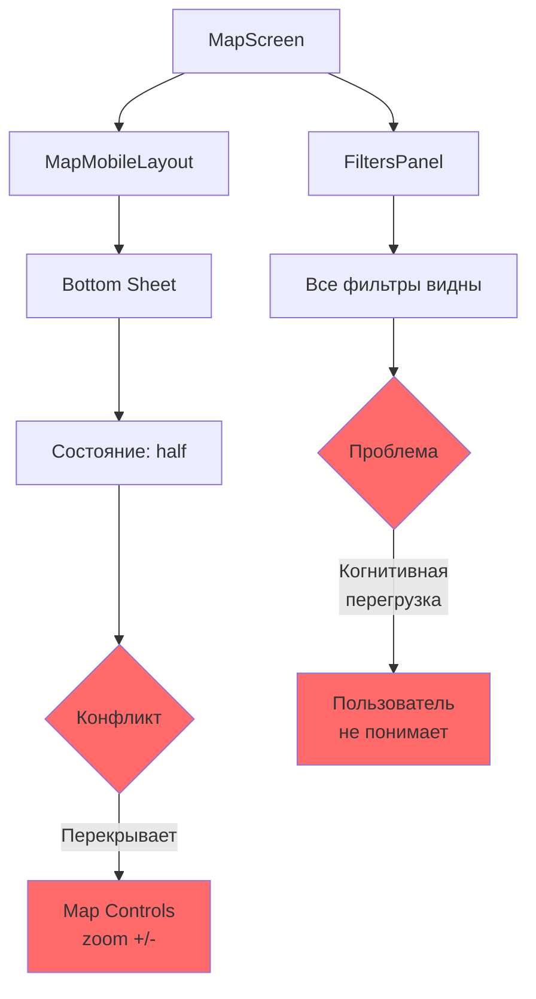
```mermaid
graph TD
    A[MapScreen] --> B[MapMobileLayout]
    B --> C[Bottom Sheet]
    C --> D[Состояние: half]
    
    D --> E{Конфликт}
    E -->|Перекрывает| F[Map Controls<br/>zoom +/-]
    
    style E fill:#ff6b6b
    style F fill:#ff6b6b
    
    A --> G[FiltersPanel]
    G --> H[Все фильтры видны]
    
    H --> I{Проблема}
    I -->|Когнитивная<br/>перегрузка| J[Пользователь<br/>не понимает]
    
    style I fill:#ff6b6b
    style J fill:#ff6b6b
```

---

## Решения (зелёным)

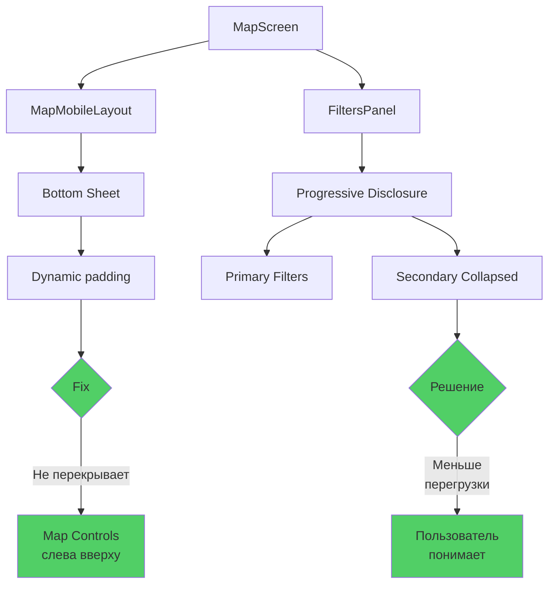
```mermaid
graph TD
    A[MapScreen] --> B[MapMobileLayout]
    B --> C[Bottom Sheet]
    C --> D[Dynamic padding]
    
    D --> E{Fix}
    E -->|Не перекрывает| F[Map Controls<br/>слева вверху]
    
    style E fill:#51cf66
    style F fill:#51cf66
    
    A --> G[FiltersPanel]
    G --> H[Progressive Disclosure]
    
    H --> I[Primary Filters]
    H --> J[Secondary Collapsed]
    J --> K{Решение}
    K -->|Меньше<br/>перегрузки| L[Пользователь<br/>понимает]
    
    style K fill:#51cf66
    style L fill:#51cf66
```

---

## Onboarding Flow (новый)

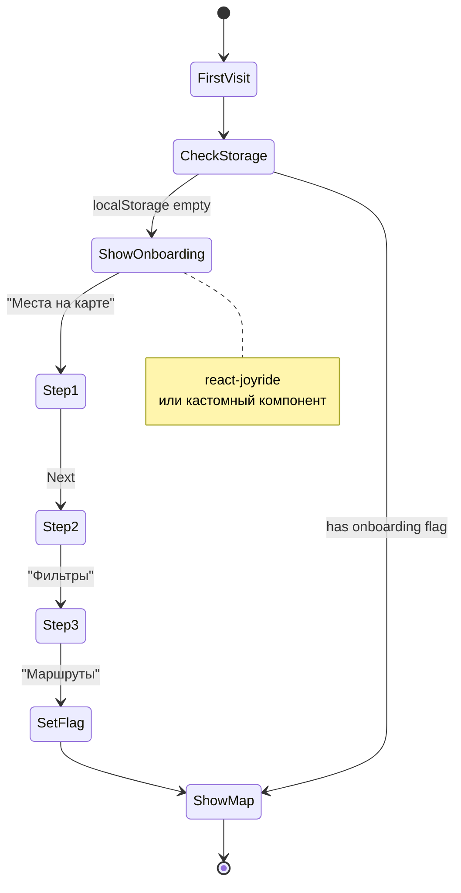
```mermaid
stateDiagram-v2
    [*] --> FirstVisit
    FirstVisit --> CheckStorage
    CheckStorage --> ShowOnboarding: localStorage empty
    CheckStorage --> ShowMap: has onboarding flag
    
    ShowOnboarding --> Step1: "Места на карте"
    Step1 --> Step2: Next
    Step2 --> Step3: "Фильтры"
    Step3 --> SetFlag: "Маршруты"
    SetFlag --> ShowMap
    
    ShowMap --> [*]
    
    note right of ShowOnboarding
        react-joyride
        или кастомный компонент
    end note
```

---

## Responsive Breakpoints

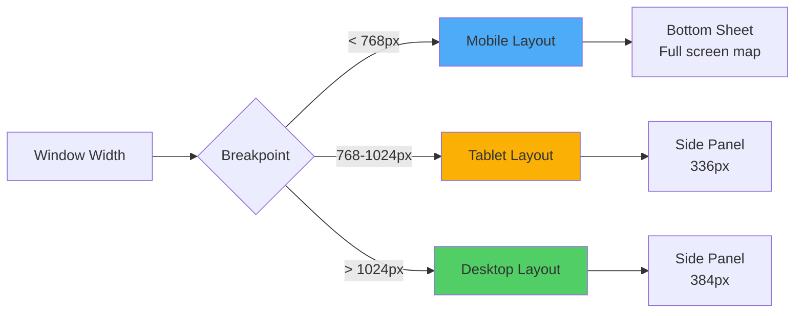
```mermaid
graph LR
    A[Window Width] --> B{Breakpoint}
    
    B -->|< 768px| C[Mobile Layout]
    B -->|768-1024px| D[Tablet Layout]
    B -->|> 1024px| E[Desktop Layout]
    
    C --> F[Bottom Sheet<br/>Full screen map]
    D --> G[Side Panel<br/>336px]
    E --> H[Side Panel<br/>384px]
    
    style C fill:#4dabf7
    style D fill:#fab005
    style E fill:#51cf66
```

---

## Bottom Sheet States

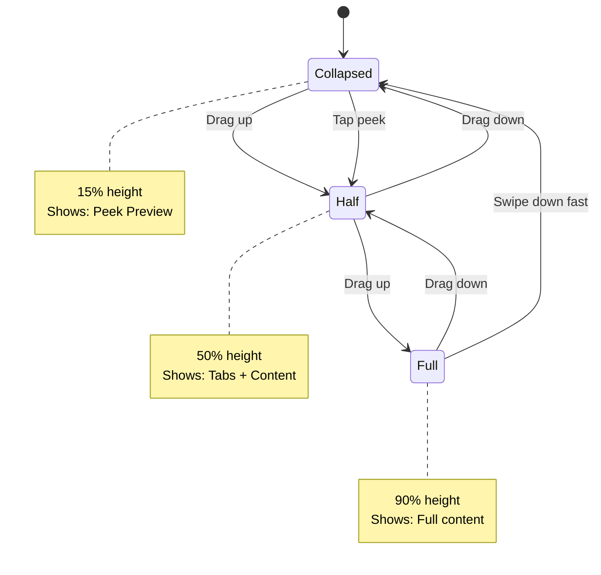
```mermaid
stateDiagram-v2
    [*] --> Collapsed
    Collapsed --> Half: Drag up
    Collapsed --> Half: Tap peek
    Half --> Full: Drag up
    Half --> Collapsed: Drag down
    Full --> Half: Drag down
    Full --> Collapsed: Swipe down fast
    
    note right of Collapsed
        15% height
        Shows: Peek Preview
    end note
    
    note right of Half
        50% height
        Shows: Tabs + Content
    end note
    
    note right of Full
        90% height
        Shows: Full content
    end note
```

---

## Filters: Primary vs Secondary

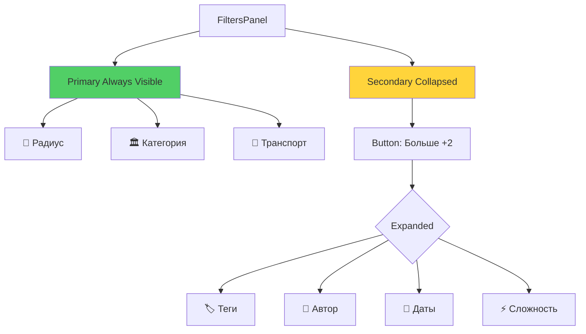
```mermaid
graph TD
    A[FiltersPanel] --> B[Primary Always Visible]
    A --> C[Secondary Collapsed]
    
    B --> D[📍 Радиус]
    B --> E[🏛️ Категория]
    B --> F[🚗 Транспорт]
    
    C --> G[Button: Больше +2]
    G --> H{Expanded}
    
    H --> I[🏷️ Теги]
    H --> J[👤 Автор]
    H --> K[📅 Даты]
    H --> L[⚡ Сложность]
    
    style B fill:#51cf66
    style C fill:#ffd43b
```

---

## Performance Optimization

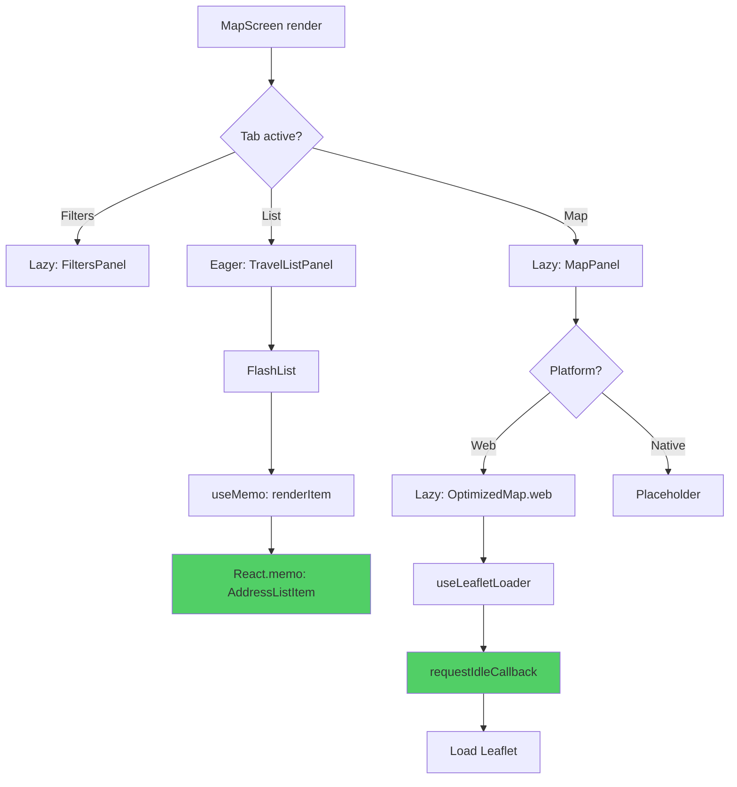
```mermaid
graph TD
    A[MapScreen render] --> B{Tab active?}
    
    B -->|Filters| C[Lazy: FiltersPanel]
    B -->|List| D[Eager: TravelListPanel]
    
    D --> E[FlashList]
    E --> F[useMemo: renderItem]
    F --> G[React.memo: AddressListItem]
    
    B -->|Map| H[Lazy: MapPanel]
    H --> I{Platform?}
    I -->|Web| J[Lazy: OptimizedMap.web]
    I -->|Native| K[Placeholder]
    
    J --> L[useLeafletLoader]
    L --> M[requestIdleCallback]
    M --> N[Load Leaflet]
    
    style G fill:#51cf66
    style M fill:#51cf66
```

---

## Error Handling Flow

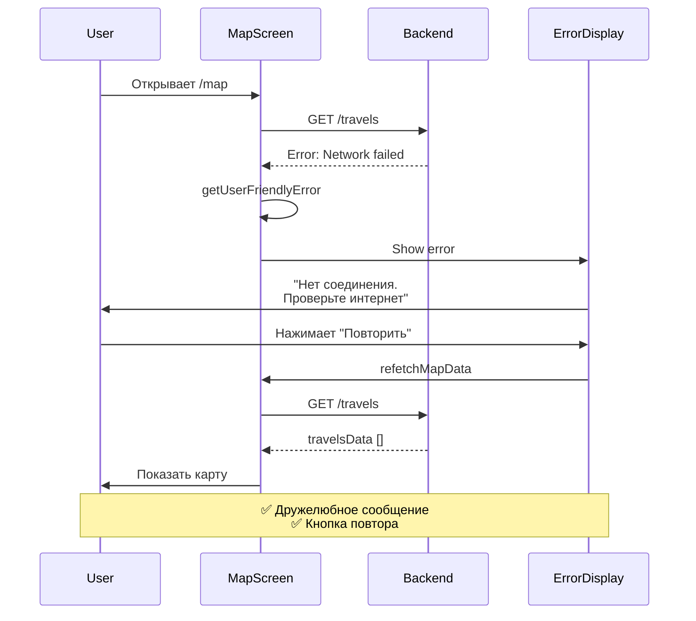
```mermaid
sequenceDiagram
    participant U as User
    participant M as MapScreen
    participant API as Backend
    participant E as ErrorDisplay
    
    U->>M: Открывает /map
    M->>API: GET /travels
    API-->>M: Error: Network failed
    
    M->>M: getUserFriendlyError
    M->>E: Show error
    E->>U: "Нет соединения.<br/>Проверьте интернет"
    
    U->>E: Нажимает "Повторить"
    E->>M: refetchMapData
    M->>API: GET /travels
    API-->>M: travelsData []
    M->>U: Показать карту
    
    Note over E,U: ✅ Дружелюбное сообщение<br/>✅ Кнопка повтора
```

---

## Toast Notifications (новые)

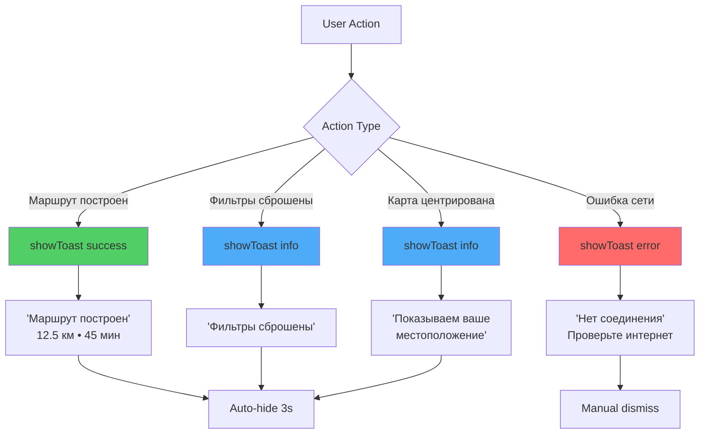
```mermaid
graph TD
    A[User Action] --> B{Action Type}
    
    B -->|Маршрут построен| C[showToast success]
    B -->|Фильтры сброшены| D[showToast info]
    B -->|Карта центрирована| E[showToast info]
    B -->|Ошибка сети| F[showToast error]
    
    C --> G["'Маршрут построен'<br/>12.5 км • 45 мин"]
    D --> H["'Фильтры сброшены'"]
    E --> I["'Показываем ваше<br/>местоположение'"]
    F --> J["'Нет соединения'<br/>Проверьте интернет"]
    
    G --> K[Auto-hide 3s]
    H --> K
    I --> K
    J --> L[Manual dismiss]
    
    style C fill:#51cf66
    style D fill:#4dabf7
    style E fill:#4dabf7
    style F fill:#ff6b6b
```

---

## Карточка места — Варианты

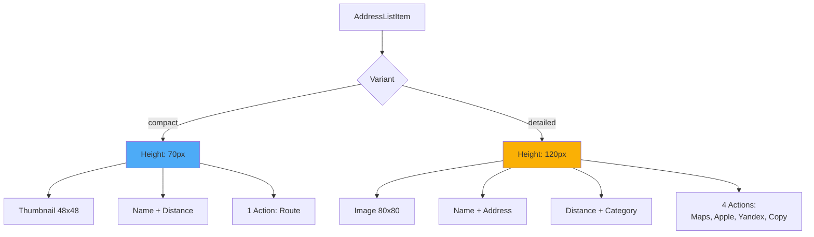
```mermaid
graph TD
    A[AddressListItem] --> B{Variant}
    
    B -->|compact| C[Height: 70px]
    B -->|detailed| D[Height: 120px]
    
    C --> E[Thumbnail 48x48]
    C --> F[Name + Distance]
    C --> G[1 Action: Route]
    
    D --> H[Image 80x80]
    D --> I[Name + Address]
    D --> J[Distance + Category]
    D --> K[4 Actions:<br/>Maps, Apple, Yandex, Copy]
    
    style C fill:#4dabf7
    style D fill:#fab005
```

---

## Route Mode — Improved UX

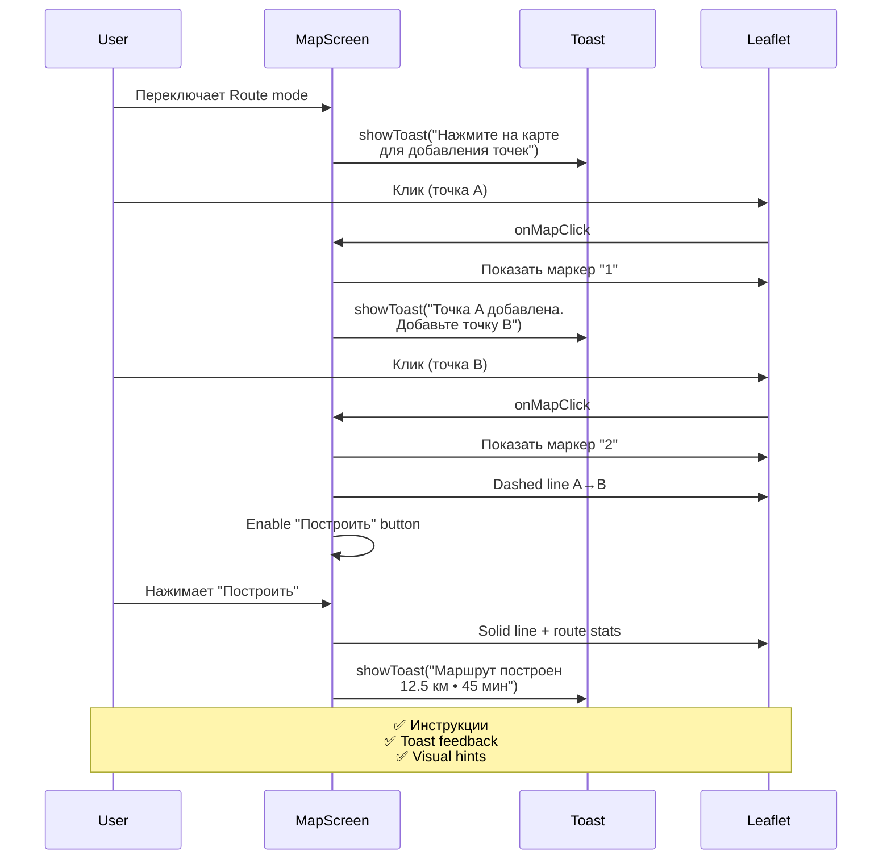
```mermaid
sequenceDiagram
    participant U as User
    participant M as MapScreen
    participant T as Toast
    participant Map as Leaflet
    
    U->>M: Переключает Route mode
    M->>T: showToast("Нажмите на карте<br/>для добавления точек")
    
    U->>Map: Клик (точка A)
    Map->>M: onMapClick
    M->>Map: Показать маркер "1"
    M->>T: showToast("Точка A добавлена.<br/>Добавьте точку B")
    
    U->>Map: Клик (точка B)
    Map->>M: onMapClick
    M->>Map: Показать маркер "2"
    M->>Map: Dashed line A→B
    M->>M: Enable "Построить" button
    
    U->>M: Нажимает "Построить"
    M->>Map: Solid line + route stats
    M->>T: showToast("Маршрут построен<br/>12.5 км • 45 мин")
    
    Note over U,Map: ✅ Инструкции<br/>✅ Toast feedback<br/>✅ Visual hints
```

---

## Legend Component (интеграция)

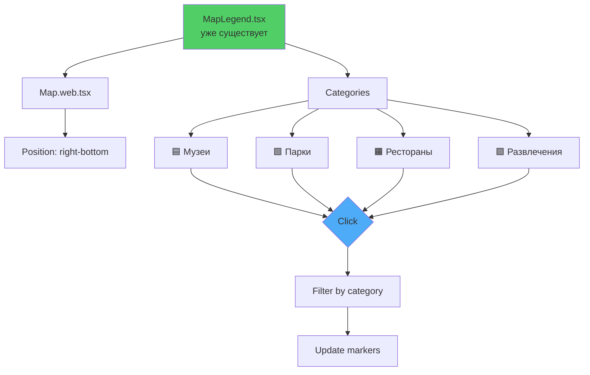
```mermaid
graph TD
    A[MapLegend.tsx<br/>уже существует] --> B[Map.web.tsx]
    B --> C[Position: right-bottom]
    
    A --> D[Categories]
    D --> E[🟦 Музеи]
    D --> F[🟩 Парки]
    D --> G[🟧 Рестораны]
    D --> H[🟪 Развлечения]
    
    E --> I{Click}
    F --> I
    G --> I
    H --> I
    
    I --> J[Filter by category]
    J --> K[Update markers]
    
    style A fill:#51cf66
    style I fill:#4dabf7
```

---

## Dark Mode для карты

```mermaid
graph TD
    A[useTheme hook] --> B{isDark?}
    
    B -->|true| C[CartoDB.DarkMatter<br/>tile layer]
    B -->|false| D[OpenStreetMap<br/>tile layer]
    
    C --> E[Marker colors]
    D --> E
    
    E --> F{isDark?}
    F -->|true| G[Light markers<br/>#51cf66, #4dabf7]
    F -->|false| H[Default markers<br/>#2D5BFF, #00C48C]
    
    style C fill:#1e2530
    style G fill:#1e2530
```

---

## Геокодер — Search Flow

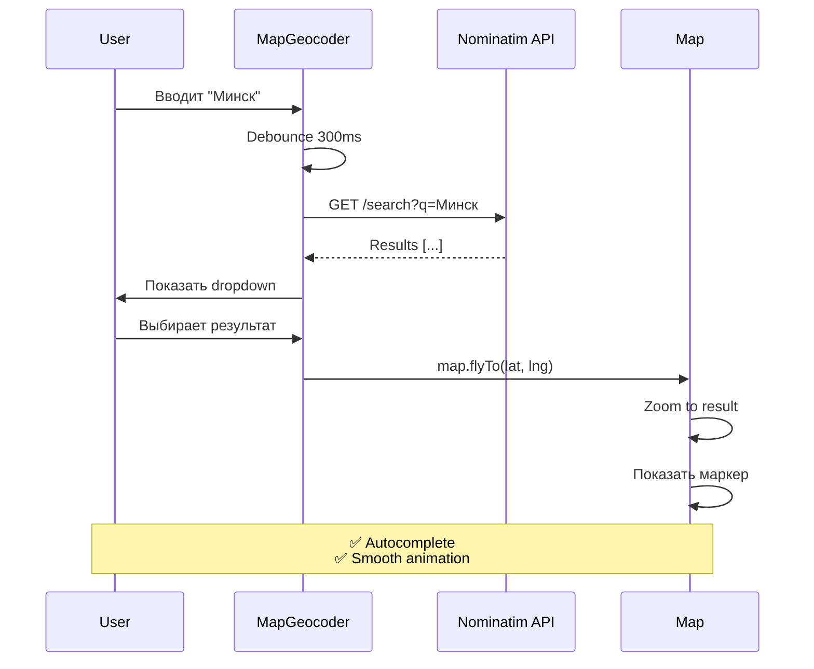
```mermaid
sequenceDiagram
    participant U as User
    participant G as MapGeocoder
    participant N as Nominatim API
    participant M as Map
    
    U->>G: Вводит "Минск"
    G->>G: Debounce 300ms
    G->>N: GET /search?q=Минск
    N-->>G: Results [...]
    G->>U: Показать dropdown
    
    U->>G: Выбирает результат
    G->>M: map.flyTo(lat, lng)
    M->>M: Zoom to result
    M->>M: Показать маркер
    
    Note over U,M: ✅ Autocomplete<br/>✅ Smooth animation
```

---

## Share маршрута — URL generation

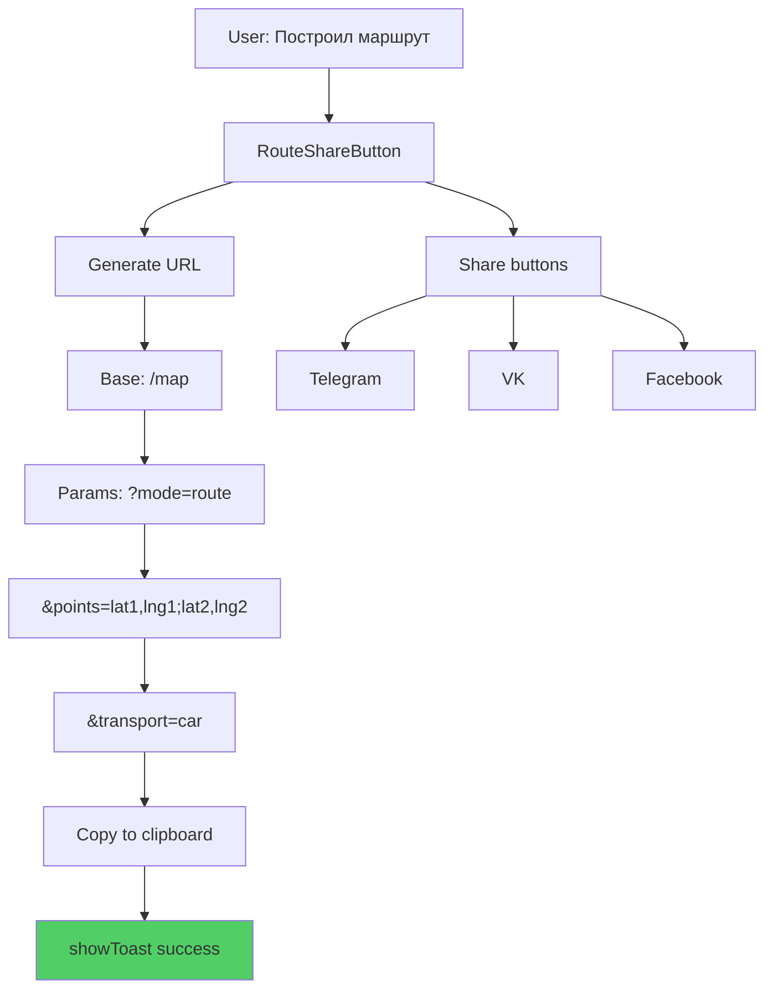
```mermaid
graph TD
    A[User: Построил маршрут] --> B[RouteShareButton]
    B --> C[Generate URL]
    
    C --> D[Base: /map]
    D --> E[Params: ?mode=route]
    E --> F[&points=lat1,lng1;lat2,lng2]
    F --> G[&transport=car]
    
    G --> H[Copy to clipboard]
    H --> I[showToast success]
    
    B --> J[Share buttons]
    J --> K[Telegram]
    J --> L[VK]
    J --> M[Facebook]
    
    style I fill:#51cf66
```

---

## Clustering — Color Gradient

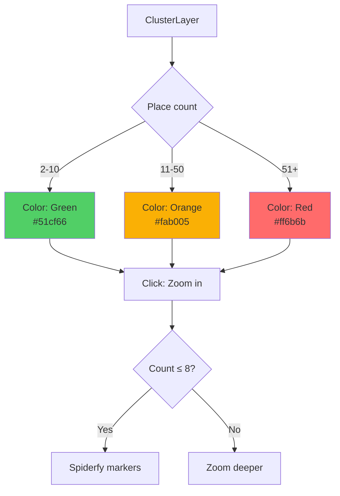
```mermaid
graph TD
    A[ClusterLayer] --> B{Place count}
    
    B -->|2-10| C[Color: Green<br/>#51cf66]
    B -->|11-50| D[Color: Orange<br/>#fab005]
    B -->|51+| E[Color: Red<br/>#ff6b6b]
    
    C --> F[Click: Zoom in]
    D --> F
    E --> F
    
    F --> G{Count ≤ 8?}
    G -->|Yes| H[Spiderfy markers]
    G -->|No| I[Zoom deeper]
    
    style C fill:#51cf66
    style D fill:#fab005
    style E fill:#ff6b6b
```

---

## Метрики отслеживания

```mermaid
graph LR
    A[User Interactions] --> B[Analytics Events]
    
    B --> C[map_opened]
    B --> D[filters_changed]
    B --> E[route_built]
    B --> F[place_clicked]
    B --> G[share_clicked]
    
    C --> H[Amplitude / GA]
    D --> H
    E --> H
    F --> H
    G --> H
    
    H --> I[Dashboard]
    I --> J[Конверсия]
    I --> K[Engagement]
    I --> L[Retention]
```

---

## Roadmap Timeline

```mermaid
gantt
    title Рефакторинг страницы карты
    dateFormat YYYY-MM-DD
    
    section P1 Foundation
    Bottom Sheet fix       :p1-1, 2026-02-10, 2d
    Toast notifications    :p1-2, after p1-1, 1d
    Error states          :p1-3, after p1-2, 1d
    Tabs improvement      :p1-4, after p1-3, 1d
    Progressive disclosure :p1-5, after p1-4, 2d
    Bottom Sheet animation :p1-6, after p1-5, 2d
    Onboarding            :p1-7, after p1-6, 2d
    
    section P2 Enhancement
    Peek Preview          :p2-1, after p1-7, 2d
    List grouping         :p2-2, after p2-1, 2d
    Route mode UX         :p2-3, after p2-2, 2d
    Loading states        :p2-4, after p2-3, 1d
    Quick Actions         :p2-5, after p2-4, 1d
    Share route           :p2-6, after p2-5, 2d
    Dark mode             :p2-7, after p2-6, 1d
    Geocoder              :p2-8, after p2-7, 3d
    Legend                :p2-9, after p2-8, 1d
    Card variants         :p2-10, after p2-9, 4d
    
    section P3 Polish
    Adaptive panel width  :p3-1, after p2-10, 2d
    Keyboard navigation   :p3-2, after p3-1, 4d
    Save route            :p3-3, after p3-2, 5d
    Heatmap mode          :p3-4, after p3-3, 3d
```

---

## Итоговая архитектура (after refactoring)

```mermaid
graph TD
    A[MapScreen] --> B{Responsive Layout}
    
    B -->|Desktop| C[Side Panel<br/>384px adaptive]
    B -->|Mobile| D[Bottom Sheet<br/>reanimated]
    
    C --> E[Tabs + Badge]
    D --> F[Peek Preview<br/>with thumbnails]
    
    E --> G[FiltersPanel<br/>Progressive]
    E --> H[TravelListPanel<br/>Grouped]
    
    F --> G
    F --> H
    
    A --> I[MapPanel]
    I --> J[Map.web.tsx]
    
    J --> K[Leaflet Map<br/>Dark mode]
    J --> L[MapControls<br/>Left position]
    J --> M[Markers<br/>Gradient clusters]
    J --> N[Legend<br/>Interactive]
    J --> O[Geocoder<br/>Search]
    
    A --> P[Onboarding<br/>First visit]
    A --> Q[Toast System<br/>Feedback]
    
    style A fill:#4dabf7
    style G fill:#51cf66
    style H fill:#51cf66
    style K fill:#51cf66
    style P fill:#fab005
    style Q fill:#fab005
```

---

**Диаграммы созданы:** 6 февраля 2026  
**Инструмент:** Mermaid  
**Статус:** Ready for implementation

