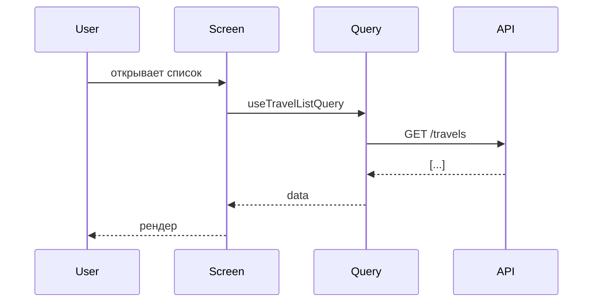

# Фича: <имя>

**Последняя актуализация:** YYYY-MM-DD
**Ответственный:** @handle

## TL;DR

Одно предложение: что делает фича, кому нужна.

## Точки входа

| Путь | Назначение |
|------|-----------|
| `app/...` | Экран/роут |
| `components/.../Index.tsx` | Корневой компонент |

## Ключевые компоненты

Дерево верхнего уровня. Не все, только несущие.

```
<RootComponent>
 ├─ <HeaderPart>
 ├─ <BodyPart>
 │   ├─ <List>
 │   └─ <Item>
 └─ <FooterPart>
```

| Файл | LOC | Зона ответственности |
|------|-----|---------------------|
| `components/.../Root.tsx` | ~200 | ... |
| `components/.../parts/Item.tsx` | ~80 | ... |

Красным отметь файлы >800 LOC — они кандидаты на распил.

## Данные

### Серверный стейт (React Query)

| Query / Mutation | Файл | Ключ | Инвалидации |
|------------------|------|------|-------------|
| `useTravelListQuery` | `api/travel/Queries.ts` | `['travel','list', filters]` | мутации: ... |

### Клиентский стейт (Zustand)

| Store | Файл | Отвечает за |
|-------|------|-------------|
| `travelFiltersStore` | `stores/travelFiltersStore.ts` | локальные фильтры списка |

### Контексты

Если есть специфичные — здесь.

## Поток данных

Mermaid-диаграмма или текстовое описание ключевого потока.



## Внешние зависимости

- API endpoints: `/travels`, `/travels/:id`, ...
- Сторонние сервисы: OpenRouteService / CDN / ...
- Env: `EXPO_PUBLIC_API_URL`, ...

## Тесты

- Unit: `__tests__/.../`
- Governance: если есть контракт
- E2E: `e2e/*.spec.ts`
- Smoke-критичные сценарии: ...

## Известные боли и TODO

- Файл X превышает 800 LOC, план распила в ADR NNNN.
- ...

## Связанные документы

- ADR NNNN — ...
- `docs/<related>.md`
