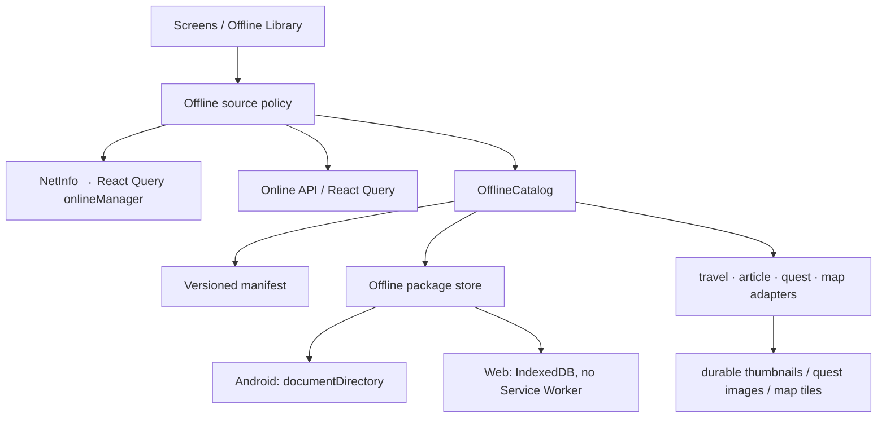

# Фича: offline-first access

**Последняя актуализация:** 2026-07-28  
**Ответственный:** frontend/app

## TL;DR

Android-приложение сохраняет выбранные пользователем маршруты, статьи, квесты и
области карты как управляемые offline-пакеты, а общий app shell и вкладки остаются
доступными без сети. Последние открытые публичные материалы служат ограниченным
автоматическим fallback, но не подменяют явное действие «Сохранить офлайн».

## Проблема и продуктовый контракт

Сейчас offline-поддержка разбита на независимые механизмы:

- `utils/queryPersist.ts` сохраняет только favorites, recommendations,
  view-history и travel-status, причём restore стартует из `useEffect` и не
  блокирует первый запрос экрана;
- `utils/publicStaleCache.ts` восстанавливает public travel list/detail только
  для unauthenticated public GET; авторизованный пользователь может получить
  hard error на тех же публичных экранах;
- `hooks/useOfflineTravelCache.ts` записывает до 20 просмотренных travel, но
  production-код не читает этот кэш при открытии detail;
- quest bundle/list уже имеют AsyncStorage fallback, а кнопка квеста прогревает
  изображения;
- Android-карта сохраняет тайлы в `documentDirectory` и умеет управлять
  регионами, но `GET /api/map/points_bulk/` ещё не подключён к локальным
  маркерам и поиску;
- article detail не имеет offline snapshot.

Из-за этого наличие кэша не означает доступность приложения: cold start или
переход на новый экран всё равно может закончиться полноэкранной ошибкой сети.

Целевой инвариант:

1. Отсутствие сети не блокирует навигационный shell, вкладки и Back.
2. Сохранённый offline-пакет открывается после Android force-stop/cold start без
   API-запроса и без бесконечного skeleton.
3. Несохранённый экран показывает локальный empty/offline state и путь к
   сохранённым материалам, а не блокирует всё приложение.
4. Пользователь видит, что сохранено, сколько места занято, когда данные
   обновлялись, и может удалить пакет.
5. Возврат сети обновляет активный экран в фоне, не выбрасывая уже показанный
   локальный контент.

## Scope MVP

Входит:

- Android cold start и навигация без сети;
- одинаковый mobile UX для Android и mobile web: offline banner, библиотека,
  save/remove actions и состояния карточек;
- явное сохранение маршрута/статьи/квеста/области карты;
- два варианта content package: «текст и маршрут» и «с фото»;
- автоматический recent fallback для последних 20 публичных материалов;
- локальные маркеры и поиск по сохранённой области карты;
- storage usage, update, cancel, retry и delete;
- RU/BE/UK/PL/EN через отдельный namespace `offline`.

Не входит в MVP:

- offline login, profile refresh, messages, weather, recommendations или другой
  private server state;
- универсальная очередь comments/ratings/uploads/publish mutations;
- сохранение полного travel gallery/video в первом релизе: режим «с фото» берёт
  cover и thumbnails, нужные для steps/route points;
- автоматическая загрузка «всего сайта»;
- Service Worker или runtime/static web caching. Это запрещено web cache policy.

Mobile web сохраняет тот же control/state contract и умеет читать выбранные
данные из IndexedDB, пока доступен app shell. Гарантия Android cold start не
переносится на web reload без сети: Service Worker не вводится.

## Точки входа

| Путь / действие | Назначение |
|---|---|
| `/offline` | библиотека сохранённых и последних доступных материалов |
| Profile/Settings → «Офлайн» | стабильный вход в библиотеку |
| offline banner → «Открыть сохранённое» | быстрый вход без блокировки текущего экрана |
| travel/article/quest detail → «Сохранить офлайн» | создать или обновить content package |
| map → «Скачать область» | сохранить тайлы и плоский point index региона |

Нижний dock не меняет набор вкладок и не отключает переходы при offline.

## UX states и Design evidence

Нормативны порядок блоков, подписи действий, empty/error/progress states,
touch-targets 44/48dp и одинаковая иерархия на mobile web/Android.

```text
┌─────────────────────────────────────┐
│ ←  Офлайн                           │
│ 4 объекта · 128 МБ       Управление │
│ [Все] [Маршруты] [Квесты] [Карты]  │
├─────────────────────────────────────┤
│ Сохранено                           │
│ [cover] Название             24 МБ  │
│         Обновлено 27 июля     [⋯]   │
│         Доступно офлайн              │
├─────────────────────────────────────┤
│ Недавно открывали                   │
│ [thumb] Название   хранится 5 дней  │
│         [Сохранить офлайн]           │
└─────────────────────────────────────┘
```

Save sheet:

```text
Сохранить офлайн
● Текст, точки и маршрут       3 МБ
○ Добавить фото               +18 МБ
[Отмена]             [Скачать]
```

Обязательные состояния:

- `online + not saved`: действие «Сохранить офлайн»;
- `downloading`: progress `done/total`, cancel, без ложного ready-state;
- `ready`: размер, saved/updated timestamp, update/remove;
- `offline + ready`: локальный контент и мягкая плашка «Офлайн»;
- `offline + recent`: stale/recent marker и действие закрепить после возврата сети;
- `offline + missing`: объяснение «Этот материал не сохранён» + переход в
  `/offline`; навигация остаётся доступной;
- `failed/partial`: retry/remove partial; старый ready package остаётся рабочим;
- `storage full`: сохранённые пользователем пакеты не удаляются автоматически;
  показывается управление хранилищем.

## Архитектура

### Слои



`OfflineCatalog` — единственный публичный контракт фичи. Экраны не читают
AsyncStorage/FileSystem напрямую и не знают, где лежит конкретный package.

```ts
type OfflineContentType = 'travel' | 'article' | 'quest' | 'map-region'

type OfflinePackageManifest = {
  schemaVersion: 1
  key: string
  type: OfflineContentType
  sourceId: string
  authScope: 'public' | `user:${string}`
  route: string
  title: string
  status: 'downloading' | 'ready' | 'failed'
  pinned: boolean
  includePhotos: boolean
  savedAt: number
  updatedAt: number | null
  lastOpenedAt: number
  etag: string | null
  bytes: number
  assetCount: number
}
```

Manifest остаётся маленьким и хранится в AsyncStorage. Snapshot JSON и durable
assets Android хранит в `documentDirectory/offline-content/v1/<key>/`; map tiles
продолжают использовать существующий `map-tiles/`. Web adapter использует
IndexedDB и не кэширует JS/HTML shell.

### Транзакция download/update

1. Создать staging entry со статусом `downloading`.
2. Получить typed snapshot через content adapter.
3. Скачать выбранные durable assets; обычного Expo Image disk cache
   недостаточно для обещания пользователю.
4. Проверить schema version, required fields, asset results и фактический размер.
5. Атомарно заменить ready package; при update старый ready package удаляется
   только после успешной фиксации нового.
6. Cancel/error удаляет staging и сохраняет прежнюю готовую версию.

User-pinned packages не удаляются автоматически. Recent fallback ограничен
20 объектами, 30 днями и суммарно 100 МБ; eviction — LRU только для `pinned=false`.
Лимит map tiles остаётся 500 МБ. Ошибка записи/нехватка места ведёт в явный
storage state, а не в silent success.

### Source policy

```text
ready package exists → render local immediately
  └─ online → background version check/update offer
no ready package → hydrated recent/stale cache
  └─ online → fetch and refresh cache
no local data + offline → local missing state, shell remains interactive
```

NetInfo подключается к `@tanstack/react-query` `onlineManager`. Restore
persisted state завершается до первого offline-sensitive query, чтобы cold start
не успевал показать hard error раньше локальных данных. Публичные travel/article/
quest adapters используют public request policy независимо от наличия auth token;
private payload не должен случайно попадать в public package.

### Content adapters

| Тип | Snapshot/API | Durable assets | Особенности |
|---|---|---|---|
| Travel | `/travels/{id}/`, `/travels/by-slug/{slug}/` | cover + route-point thumbnails | использовать один canonical id/slug key; читать package в detail hook |
| Article | `/articles/{id|slug}/` | cover + inline thumbnail set MVP | rich text проходит существующий sanitizer pipeline |
| Quest | `/quests/by-quest-id/{questId}/` | cover, step images, finale poster | мигрировать существующий quest bundle cache без потери progress |
| Map region | `/map/points_bulk/?bbox=...` + tile proxy | existing persistent tiles | хранить ETag, point index и локальный title/address search |

## Privacy и account lifecycle

- Public package не содержит token/header и доступен независимо от сессии.
- Auth-only/private response нельзя сохранять как public package.
- User-scoped package получает `authScope=user:<id>` и не показывается другому
  пользователю; logout не обязан удалять его без отдельного подтверждения, но
  скрывает до возврата той же identity.
- Tokens, request headers и raw errors не входят в manifest или snapshots.

## Localization impact

Все app-owned copy, accessibility labels, dates, sizes, pluralization и storage
states покрываются RU/BE/UK/PL/EN. Новый namespace `offline` регистрируется в
`i18n/resources.ts`; форматирование идёт через `i18n/format.ts`. Editorial/API
content не переводится на клиенте.

## Validation contract

Automated:

- manifest migrations, atomic update/cancel/rollback, LRU only for recent;
- identity isolation и запрет private→public persistence;
- persisted restore before offline query, NetInfo reconnect and no hard shell gate;
- adapter round-trip for travel/article/quest/map;
- package size/asset counts are measured, not inferred;
- `npm run test:i18n`, native governance and scope quality gate.

Runtime matrix:

- desktop web regression smoke;
- mobile web: save/list/open/delete, offline transition in loaded app, reconnect;
- Android local USB build: `AND-USB-04`, `AND-USB-13`, `AND-USB-15`, expanded
  `AND-USB-16`, map `AND-USB-08/27` and quest `AND-USB-11`;
- Android must cover online save → force-stop → network disabled → cold launch →
  tab switching → open every saved type → restore network → refresh;
- evidence records package count, bytes, assets, cache source and recovery time;
  «страница открылась» без этих values не закрывает Done gate.

## Связанные текущие контракты

- board `#603` — public last-success cache; recurrence owner для hard offline
  errors;
- board `#1015/#994` — React Query persistence foundation;
- board `#908` — deployed map `points_bulk` + ETag;
- board `#909` — tile proxy rate contract;
- `utils/publicStaleCache.ts`, `utils/queryPersist.ts`;
- `api/questBundleCache.ts`, `hooks/useOfflineTravelCache.ts`;
- `hooks/map/useOfflineTileDownload.ts`, `utils/mapTileCache.ts`;
- `docs/NATIVE_COMPAT_RULES.md` and `docs/MANUAL_TEST_CASES.md`.

