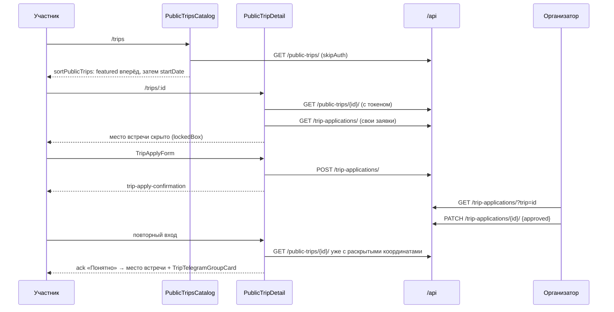

# Фича: trips (совместные поездки и планировщик маршрута)

**Последняя актуализация:** 2026-08-17

**Ответственный домен:** frontend trips/planning

**Планы и roadmap:** [social-trips-gamification-roadmap](./social-trips-gamification-roadmap.md) —
это документ о намерениях и статусе областей. Здесь описано только фактическое
поведение кода в репозитории.

## TL;DR

`/trips` — четыре разные поверхности под одним префиксом: каталог публичных
поездок «Поехали со мной» (`api/publicTrips.ts`), личный кабинет «Мои поездки»,
каталог маршрутов сообщества и планировщик поездки (`api/plannedTrips*.ts`).
Публичная поездка и planned trip — разные сущности с разными DTO, разными
ключами React Query и разными эндпоинтами; общего у них только префикс URL и
папка компонентов. Каталог публичных поездок отдаёт заметно меньше полей, чем
описывает доменный тип `PublicTrip`: обложка, дата окончания, статус своей
заявки и владение в ответе отсутствуют и достраиваются на клиенте.

## Границы

| Поверхность | Что это | Источник данных |
| --- | --- | --- |
| Публичные поездки (`/trips`, `/trips/:id`) | каталог «Поехали со мной»: чужая поездка, набор попутчиков, заявки, одобрение, раскрытие места встречи | `api/publicTrips.ts`, `hooks/usePublicTripsApi.ts` |
| Мои поездки (`/trips/my`) | дашборд из трёх сегментов: организую / участвую / мои заявки | `usePlannedTripsApi` + `usePublicTripsApi` |
| Маршруты сообщества (`/trips/community`) | опубликованные после отчёта маршруты (`content_type=community_route`) | `fetchCommunityTrips` поверх того же `/public-trips/` |
| Планировщик (`/trips/plan/create`, `/trips/plan/:id`) | своя поездка: метаданные, конструктор маршрута, участники, RSVP, предложения точек, чат/Telegram, отчёт, рейтинг, экспорт | `api/plannedTrips*.ts`, `hooks/usePlannedTripsApi.ts` |

Смежные, но не принадлежащие фиче: `api/tripChat.ts`, `api/tripTelegramGroup.ts`,
`api/participantRating.ts`, `components/profile/ProtectedContacts.tsx`,
достижения. Они вызываются из планировщика и детали поездки, но имеют своих
владельцев.

## Точки входа

Все trips-роуты объявлены в `app/(tabs)/_layout.tsx` как **скрытые табы**
(`HIDDEN`, строки 240–246): в таб-баре их нет. В шапке (`constants/headerNavigation.ts`)
есть ровно один пункт — `/trips` («Попутчики», `priority: 'primary'`), причём
`CustomHeaderNavSection.tsx:30` его из своего горизонтального ряда
**отфильтровывает** (`item.path !== '/trips'`), так что в этой навигационной
секции подраздел не отображается совсем. `components/layout/bottomDockModel.ts:91` подсвечивает
весь подраздел одним пунктом: `startsWith('/trips') → '/trips'`.
`/trips` — раздел навигации (`TOP_LEVEL_SECTION_PATHS` в
`components/layout/topLevelSections.ts`), поэтому контекст-бара на нём нет, а
вложенные `/trips/*` получают крошки из `hooks/useBreadcrumbModel.ts`.

| Путь | Web-вариант | Native-вариант | Отличие |
| --- | --- | --- | --- |
| `/trips` | `app/(tabs)/trips/index.tsx` | `index.native.tsx` (6 LOC) | web: `TripsPageSeo` + `React.lazy` + `Suspense`; native: прямой импорт `PublicTripsCatalog` |
| `/trips/my` | `my.tsx` | `my.native.tsx` (5 LOC) | web добавляет только SEO; lazy нет |
| `/trips/community` | `community.tsx` | `community.native.tsx` (6 LOC) | web: SEO + `useWebHydrationGate()` + `React.lazy`/`Suspense` |
| `/trips/:id` | `[id].tsx` (57 LOC) | `[id].native.tsx` (59 LOC) | разные резервы под нижний док, см. ниже |
| `/trips/plan` | `plan/index.tsx` (12 LOC) | — | `router.replace('/trips/my')` в `useEffect`, рендерит `null` |
| `/trips/plan/create` | `plan/create.tsx` (106 LOC) | — | один файл на обе платформы; auth-гейт по `authReady`/`isAuthenticated` |
| `/trips/plan/:id` | `plan/[id].tsx` (688 LOC) | — | один файл на обе платформы, без гидрационного гейта |

Два разных гидрационных хука, не взаимозаменяемые:

- `community.tsx` использует `useWebHydrationGate()` (`hooks/useWebHydrationGate.ts`) —
  отложенное раскрытие через `setTimeout(delayMs)` + `requestAnimationFrame`,
  с `startTransition`; таймер несущий, rAF только ускорение;
- `[id].tsx` использует `useHydrationReady()` (`hooks/useHydrationReady.ts`) —
  `false` на SSR и первом web-рендере, `true` сразу после коммита. Здесь он
  не «ждёт кадр ради CLS», а гасит парсинг `params.id`: `tripId` до гидрации
  равен `NaN`, и вместо `PublicTripDetail` рисуется спиннер.

Резерв под нижним доком сделан по-разному намеренно:

- web (`[id].tsx`, `plan/create.tsx`): CSS-переменные —
  `calc(max(var(--mt-dock-h, 0px), var(--mt-keyboard-inset, 0px)) + 24px)`
  в `contentContainerStyle.paddingBottom`;
- native (`[id].native.tsx`): отдельный пустой `View`
  (`testID="trip-detail-bottom-reserve"`, `pointerEvents="none"`), потому что
  `padding` у `contentContainer` на Android не давал докрутить до CTA. Высота
  переключается с `tabBarHeight + insets.bottom` на фактический
  `rootBottomOverlap` при открытой клавиатуре. Плюс `keyboardShouldPersistTaps="handled"`:
  без него первый тап по кнопке отправки заявки только прятал клавиатуру.

`TripsPageSeo` (`components/trips/TripsPageSeo.tsx`, 71 LOC) стоит на всех
web-роутах, рендерится только при `useIsFocused()`, строит `canonical` через
`buildCanonicalUrl` и заголовок `<label> | Metravel`.

## Ключевые компоненты

```
/trips            → PublicTripsCatalog
                     ├─ PublicTripFilters
                     ├─ PublicTripCard × N
                     └─ SafetyNotice
/trips/:id        → PublicTripDetail
                     ├─ TripStatusBadge
                     ├─ reveal-блок (место встречи + TripTelegramGroupCard)
                     ├─ OrganizerApplicationsPanel   (только isOwner)
                     └─ TripApplyForm                (только не-владелец, status=open)
/trips/my         → MyTripsDashboard
                     ├─ MyCreatedTripsList role=organized|participating
                     ├─ MyApplicationsList
                     └─ TripNotificationsList
/trips/community  → CommunityRoutesCatalog → TripPlanCard × N
/trips/plan/create→ TripCreateForm
/trips/plan/:id   → PlannedTripScreen (табы route|people|export|more)
                     ├─ route : RouteBuilder
                     │           ├─ TripPlanRouteMap(.web)
                     │           ├─ RoutePointRow × N (useRoutePointDrag)
                     │           ├─ RouteSummaryBar
                     │           ├─ TripBikeTypeControl
                     │           ├─ RouteElevationProfile (safeLazy)
                     │           └─ TripRouteDownloadButtons
                     ├─ people: TripParticipantsList, TripRsvpControl,
                     │          TripInvitePanel, TripSuggestPointForm,
                     │          TripSuggestionsPanel, TripTelegramGroupCard,
                     │          TripChatPanel
                     ├─ export: TripRouteExportMenu → TripRouteDownloadButtons
                     └─ more  : TripReportForm, TripRatingPanel, TripAffiliateBlock
```

| Файл | LOC | Зона ответственности |
| --- | --- | --- |
| `components/trips/planning/RouteBuilder.tsx` | **979 — >800, кандидат на распил** | конструктор маршрута: точки, порядок, поиск по местам/путешествиям сайта, шаблоны, транспорт/тип велосипеда, живая сводка, экспорт, сохранение |
| `app/(tabs)/trips/plan/[id].tsx` | 688 | экран поездки: шапка, owner-редактор метаданных, табы планировщика, удаление |
| `components/trips/planning/TripPlanRouteMap.web.tsx` | 661 | Leaflet/React-Leaflet карта конструктора на web, слои, fullscreen |
| `components/trips/planning/TripCreateForm.tsx` | 653 | форма создания поездки, yup-валидация, prefill из travel |
| `components/trips/MyCreatedTripsList.tsx` | 483 | список моих поездок (организую/участвую), фильтры, удаление |
| `components/trips/planning/TripReportForm.tsx` | 422 | пост-отчёт и публикация маршрута в сообщество |
| `components/trips/chat/TripChatPanel.tsx` | 409 | чат поездки |
| `components/trips/PublicTripsCatalog.tsx` | 404 | каталог: поиск, фильтры, адаптивная сетка 1/2/3 колонки |
| `components/trips/PublicTripFilters.tsx` | 391 | панель фильтров каталога |
| `components/trips/planning/RoutePointRow.tsx` | 321 | строка точки маршрута: на mobile — вся строка кнопка «открыть точку» плюс инлайн-редактор в карточке, на desktop — четыре кнопки управления |
| `components/trips/planning/useRoutePointDrag.ts` | 305 | drag&drop точек маршрута поверх `routePointReorder` |
| `components/trips/planning/TripPlanCard.tsx` | 304 | карточка planned/community trip |
| `components/trips/PublicTripDetail.tsx` | 303 | деталь публичной поездки, reveal, гейты заявки |
| `components/trips/planning/TripPlanRouteMap.tsx` | 275 | та же карта на native: `MapPage/Map` (Leaflet в WebView) |
| `components/trips/planning/TripRatingPanel.tsx` | 249 | оценки участников после завершения |
| `components/trips/OrganizerApplicationsPanel.tsx` | 238 | решения организатора по заявкам |
| `components/trips/planning/TripInvitePanel.tsx` | 232 | приглашение участников, share-ссылки |
| `components/trips/planning/TripSuggestPointForm.tsx` | 221 | предложение точки участником |
| `components/trips/planning/tripPlanFormatting.ts` | 214 | метки/иконки/цвета планировщика, сводка маршрута строкой, даты |
| `components/trips/TripApplyForm.tsx` | 189 | форма «Хочу поехать» |
| `components/trips/planning/TripSuggestionsPanel.tsx` | 189 | список предложенных точек и решения |
| `components/trips/communication/TripTelegramGroupCard.tsx` | 185 | группа Telegram поездки |
| `components/trips/planning/RouteBuilderMobile.tsx` | 183 | мобильная раскладка вкладки «Маршрут» (#1691): карта фиксированной высоты блоком в потоке страницы, строка «транспорт · итог», панель — контент под ней. Своего скролла не заводит |
| `components/trips/planning/plannedTripScreen.styles.ts` | 182 | стили экрана поездки |
| `components/trips/planning/CommunityRoutesCatalog.tsx` | 176 | каталог маршрутов сообщества |
| `components/trips/MyTripsDashboard.tsx` | 167 | дашборд «Мои поездки», сегменты и счётчики |
| `components/trips/planning/RouteBuilder.styles.ts` | 165 | стили конструктора |
| `components/trips/planning/TripRouteExportMenu.tsx` | 150 | экспорт: скачивание + открытие в навигаторе |
| `components/trips/planning/RouteSummaryBar.tsx` | 147 | сводка маршрута под конструктором |
| `components/trips/planning/TripParticipantsList.tsx` | 124 | участники и их RSVP |
| `components/trips/planning/TripPlanningEmptyState.tsx` | 121 | пустое состояние планировщика |
| `components/trips/PublicTripCard.tsx` | 114 | карточка публичной поездки |
| `components/trips/TripNotificationsList.tsx` | 113 | уведомления о заявках |
| `components/trips/planning/tripRouteExport.ts` | 110 | единая сборка GPX/KML + хук состояния экспорта |
| `components/trips/MyApplicationsList.tsx` | 99 | мои заявки и отмена |
| `components/trips/planning/tripFallbackCover.ts` | 97 | детерминированная обложка-заглушка |
| `components/trips/planning/TripRsvpControl.tsx` | 97 | going/maybe/declined |
| `components/trips/planning/TripRouteDownloadButtons.tsx` | 94 | пара кнопок GPX/KML, общая для двух мест |
| `components/trips/planning/TripPlanLinkedText.tsx` | 246 | автолинк в описании: на web настоящий `<a href>`, на native `onPress` |
| `components/trips/planning/TripPlanLinksBlock.tsx` | 85 | блок «Ссылки» — чипы с доменами из описания поездки |
| `components/trips/tripFormatting.ts` | 74 | метки/цвета статусов каталога, даты, места |
| `components/trips/planning/TripAffiliateBlock.tsx` | 74 | партнёрские ссылки |
| `components/trips/TripsPageSeo.tsx` | 71 | SEO-обёртка всех trips-роутов |
| `components/trips/TripStatusBadge.tsx` | 66 | бейдж статуса поездки/заявки |
| `components/trips/planning/routePointReorder.ts` | 61 | чистая арифметика переупорядочивания |
| `components/trips/publicTripCatalogUtils.ts` | 39 | сортировка (featured вперёд), поиск, признак активных фильтров |
| `components/trips/planning/TripBikeTypeControl.tsx` | 48 | выбор типа велосипеда |

Всего `components/trips/**` — 44 файла, ~11k LOC вместе с роутами.

## Модель данных

### Публичная поездка (`api/publicTrips.ts`)

`PublicTrip`: `id`, `slug`, `title`, `coverUrl`, `region`, `tripType`,
`startDate`, `endDate`, `organizer {id,name,avatarUrl}`, `seatsTotal`,
`seatsTaken`, `status: open|full|completed`, `description`, `featured`,
`myApplicationStatus`, `isOwner`, `meetingPoint`, `contactNote`.

DTO `PublicTripDto` (snake_case): `id`, `owner`, `owner_profile`, `title`,
`description`, `start_at`, `transport_mode`, `is_public`, `seats_count`,
`start_point_name`, `start_lat`, `start_lng`, `meeting_point_hidden`,
`status: planned|active|completed`, `catalog_status`,
`going_participants_count`, `available_seats`, `featured`, `created_at`,
`updated_at`.

`owner_profile` в openapi помечен как string, фактически приходит объектом —
`ProfileField = ProfileObject | string | null`, разбор через
`profileId/profileName/profileAvatar`.

### Заявка

`TripApplication`: `id`, `tripId`, `tripTitle`, `applicant {id,name,avatarUrl,activitySummary,badges}`,
`message`, `socialLinks: string[]`, `status`, `createdAt`.

Статусы бэка → домен: `new→new`, `reviewing→pending`, `approved→approved`,
`rejected→rejected`, `canceled→cancelled` (домен пишет `cancelled` с двумя `l`,
бэк — `canceled` с одной). На бэке соцсети — три отдельных поля
`instagram/facebook/telegram`; `splitSocialLinks` раскладывает произвольный
список ссылок по этим полям эвристикой по подстроке (`instagram`, `facebook`/`fb.`,
`t.me`/`telegram`), всё нераспознанное падает в `telegram`.

### Уведомление

`TripNotification`: `kind: new_application|status_change` (выводится из
`notification_type === 'application_created'`), `tripId`, `tripTitle`,
`applicationId`, `status`, `message`, `createdAt`, `read`. Текст
`message` собирается **на клиенте** через `i18nT('errorsStatic:api.publicTrips.*')`;
`dto.body`/`dto.title` используются только как последний fallback.

### Planned trip (`api/plannedTripsTypes.ts`)

`PlannedTrip`: `id`, `slug`, `title`, `description`, `startDate`, `startTime`,
`transport: car|bike|foot|public|mixed`, `bikeType: regular|road|mountain|null`,
`visibility: public|followers|private`, `seatsTotal`, `startPoint`,
`status: planning|active|completed`, `organizer`, `route: RoutePoint[]`,
`routeGeometry`, `routeSummary`, `routingState`, `participants`, `coverUrl`,
`region`, `publishedToCommunity`, `report`, `isOwner`, `myRsvp`, `createdAt`.

- `RoutePoint`: `id: string`, `type: place|custom|rest|overnight`, `name`,
  `description`, `coordinates: [lng, lat] | null`, `placeId`.
  Порядок домена — **[lng, lat]**, в PUT уходит раздельными `lat`/`lng`.
  `type: 'place'` существует только вместе с непустым `placeId`: в PUT он уходит
  как `point_type: 'travel'`, а бэкенд (`validate_route_point_attrs`) отклоняет
  такую точку без привязки и валит весь запрос. Поэтому «Место» ставится только
  выбором места или путешествия в поиске по сайту, а не переключателем типа
  (#1532); из формы редактирования чип «Место» скрыт для точки без `placeId`.
- `RouteSummary`: `distanceKm`, `durationMin`, `elevationGainM`, `stopsCount`,
  `provider?`, `updatedAt?`.
- `RoutingState`: `provider`, `isOptimal`, `fallbackReason`, `warnings[]`.
- `TripRouteElevation`: `status: ready|degraded|unavailable`, `provider`,
  `ascentM`, `descentM`, `preview: ParsedRoutePreview|null`, `geometry`, `calculatedAt`.
- `TripParticipant` = `TripPerson` + `rsvp: going|maybe|declined|invited` +
  `role: organizer|participant`.
- `TripReport`: `summary`, `photoUrls`, `gpxUrl`, `visitedPlaceIds`, `published`,
  `publishedAt`.

## Что реально возвращает API публичных поездок и чего в нём НЕТ

Это главная ловушка фичи: доменный тип `PublicTrip` шире реального ответа, и
несколько его полей **всегда** захардкожены в `mapTrip` (`api/publicTrips.ts:250`).

| Поле `PublicTrip` | Что приходит из `/api/public-trips/` | Реальное значение |
| --- | --- | --- |
| `coverUrl` | ничего | **всегда `null`** — «BE-каталог не отдаёт обложку»; UI подставляет `getTripFallbackCover` |
| `endDate` | ничего | **всегда `null`** — каталожный сериализатор не отдаёт конец поездки, поэтому `formatTripDates` печатает одну дату |
| `myApplicationStatus` | ничего | **всегда `null`**, даже на детали; статус своей заявки экран достаёт из отдельного `useMyTripApplications()` и сопоставляет по `tripId` |
| `isOwner` | ничего | **всегда `false`** из API; владение вычисляет `usePublicTrip` в `select` — сравнение `trip.organizer.id` с `authStore.userId` |
| `contactNote` | ничего | **всегда `null`** — контактной заметки в ответе нет вообще |
| `slug` | ничего | `String(dto.id)` — это не slug, роутинг идёт по числовому id |
| `region` | `start_point_name` | это точка старта, отдельного поля региона нет |
| `tripType` | `transport_mode` | тип поездки = способ передвижения |
| `startDate` | `start_at` (ISO с офсетом) | приводится к локальному календарному дню через `parseTripDateTime` (#1313) |
| `seatsTaken` | `going_participants_count` или `seats_count − available_seats` | второй путь — вычисление, не факт бэка |
| `meetingPoint` | `start_point_name` + `start_lat`/`start_lng` | склейка `«имя · lat, lng»`; для анонима координаты `null` и `meeting_point_hidden=true` → поле `null` (post-approval reveal #410) |
| `featured` | `dto.featured ?? false` | комментарий в интерфейсе говорит «поля ещё нет в BE-сериализаторе», комментарий в `mapTrip` — что поле пришло с commit 3d7f4f2; расхождение внутри одного файла |

Следствия в UI:

- деталь публичной поездки ходит **без** `skipAuth` (`fetchPublicTrip`), иначе
  бэк не раскроет место встречи; каталог, наоборот, идёт с `skipAuth: true`;
- заявки на конкретную поездку запрашиваются как `/trip-applications/?trip=<id>&perPage=100`
  и **повторно** фильтруются на клиенте по `tripId`;
- `TripApplicant.activitySummary` всегда `null`, `badges` всегда `[]` —
  «сводка активности» и бейджи заявителя в панели организатора не наполняются.

Аналогичные дыры на стороне planned trips:

| Поле | Где | Значение |
| --- | --- | --- |
| `region` | `mapTrip` (planned) | **всегда `''`** — фильтр по региону в `MyCreatedTripsList` строит опции из `trip.region` и потому остаётся пустым |
| `publishedToCommunity` | `mapTrip` | **всегда `false`** |
| `report` | `mapTrip` | **всегда `null`**; отчёт виден только в ответе мутации `submitTripReport`, после рефетча теряется |
| `startPoint` | `mapTrip` | **всегда `null`**, хотя при создании отправляется |
| `visibility` | `mapTrip` | `dto.is_public ? 'public' : 'private'` — значение `followers` из БД получить невозможно |
| `route`, `routeGeometry`, `routeSummary`, `routingState`, `participants`, `coverUrl` | `mapCommunityTrip` | **пусты/`null` по построению** — в каталоге сообщества маршрута нет |
| `RouteTemplate.points` / `.transport` | `mapTemplate` | `points: []`, `transport: 'car'` захардкожены; «Применить шаблон» ставит пустой маршрут |
| `report.photoUrls` | `submitTripReport` | **всегда `[]`** — форма загружает фото, ответ их не возвращает |

Фильтры `CommunityTripsFilters.minDistanceKm`/`maxDistanceKm` объявлены в типе и
входят в ключ запроса, но `fetchCommunityTrips` кладёт в query только
`content_type`, `transport_mode` и `region`; данных о расстоянии в
`mapCommunityTrip` тоже нет. Работают эти фильтры только в mock-ветке
(`matchesCommunity`).

### Эндпоинты

Публичные поездки:

| Функция | Метод и путь | Примечание |
| --- | --- | --- |
| `fetchPublicTrips` | `GET /public-trips/?perPage=100[&region&type&status]` | `skipAuth`, фильтрация server-side (#407) + defensive `matchesFilters` на клиенте |
| `fetchPublicTrip` | `GET /public-trips/{id}/` | с токеном ради reveal |
| `fetchMyApplications` | `GET /trip-applications/?perPage=100` | queryset scoped по applicant |
| `fetchTripApplications` | `GET /trip-applications/?trip={id}&perPage=100` | + клиентский фильтр |
| `fetchTripNotifications` | `GET /trip-notifications/?perPage=100` | |
| `submitApplication` | `POST /trip-applications/` `{trip,message,instagram,facebook,telegram}` | 400 с текстом `application already exists for this trip` распознаёт `isDuplicateTripApplicationError` |
| `cancelApplication` | `PATCH /trip-applications/{id}/ {status:'canceled'}` | |
| `decideApplication` | `PATCH /trip-applications/{id}/ {status:'approved'\|'rejected'}` | |

Планировщик:

| Функция | Метод и путь | Примечание |
| --- | --- | --- |
| `fetchMyPlannedTrips` | `GET /trips/planned/me/` | голый массив, не пагинация |
| `fetchPlannedTrip` | `GET /trips/planned/{id}/` | |
| `fetchCommunityTrips` | `GET /public-trips/?content_type=community_route[&transport_mode&region]` | `skipAuth`; тот же URL, что каталог |
| `createTrip` | `POST /trips/planned/` | `is_public`, `max_participants`, `transport_mode`, `start_*`, `create_telegram_group` |
| `updatePlannedTrip` | `PATCH /trips/planned/{id}/` | метаданные + обложка |
| `updatePlannedTripTransport` | `PATCH /trips/planned/{id}/ {transport_mode}` | перестраивает маршрут на бэке |
| `updatePlannedTripBikeType` | `PATCH /trips/planned/{id}/ {bike_type}` | меняет профиль ORS, отдельный rebuild не нужен |
| `updateTripRoute` | `PUT /trips/planned/{id}/route/ {points[]}` | `order` 1-based, см. ловушки |
| `deletePlannedTrip` | `DELETE /trips/{id}/` | путь **без** `planned` |
| `setRsvp` | `POST /trips/planned/{id}/rsvp/ {status:'accepted'\|'declined'}` | затем повторный `fetchPlannedTrip` |
| `inviteParticipants` | `POST /trips/planned/{id}/invite/ {user_ids}` | |
| `fetchTripSuggestions` | `GET /trip-route-suggestions/?trip={id}` | |
| `suggestPoint` | `POST /trip-route-suggestions/` | `travel` = `placeId` |
| `decideSuggestion` | `PATCH /trip-route-suggestions/{id}/ {status,rejection_reason}` | |
| `submitTripReport` | `POST /trips/{id}/complete/` | затем `fetchPlannedTrip` и ручная сборка `report` |
| `fetchRouteTemplates` | `GET /trips/route-templates/` | |
| `fetchTripRouteElevation` | `GET /trips/{id}/route-summary/` | требует токен |
| `refreshTripRouteElevation` | `POST /trips/{id}/route-summary/ {provider:'ors',force_refresh:true}` | owner-only |
| `listPlannedTripRouteFiles` / `fetchPlannedTripRouteFile` | `GET /trips/planned/{id}/routes/` | #1496; список из нуля-одного элемента, owner-only |
| `uploadPlannedTripRouteFile` | `POST /trips/planned/{id}/routes/` (multipart `file`) | создаёт (201) или заменяет (200) с тем же id |
| `downloadPlannedTripRouteFileBlob` | `GET /trips/planned/{id}/routes/{routeId}/download/` | отдаёт ровно загруженные байты |
| `deletePlannedTripRouteFile` | `DELETE /trips/planned/{id}/routes/{routeId}/` | 204 |

### Исходный файл маршрута (фаза 2 импорта, #1496)

У поездки хранится **ноль или один** исходный GPX/KML (`api/plannedTripRoutes.ts`,
backend-контракт #1493). Хранилище доступно только владельцу поездки: участник
получает 403, аноним — 401, и хук `usePlannedTripRouteFile` трактует
401/403/404/501 как «оригинала нет», а не как ошибку экрана.

Что делает фронт:

1. `TripRouteImportPanel` вместе с текстом файла получает от пикера сам файл
   (`upload`: `File` на web, кэш-копия `{uri,name,type}` на native) и отдаёт его
   наверх при «Заменить»/«Добавить»;
2. `RouteBuilder.handleSave` сначала сохраняет точки `PUT /route/`, затем грузит
   оригинал — так файл и точки не расходятся. Отказ загрузки не откатывает точки:
   показывается ошибка, файл остаётся выбранным, повтор — тем же «Сохранить маршрут»;
3. `usePlannedTripOriginalTrack` скачивает исходник и разбирает его тем же
   `parseRouteFilePreviews`, что и фаза 1; `buildOriginalTrackGeometry`
   (`tripOriginalTrack.ts`) переносит **все** точки трека, обрезая только выше
   защитного потолка `ORIGINAL_TRACK_MAX_DISPLAY_POINTS = 12000`;
4. `TripPlanRouteMap` рисует эту геометрию **отдельным слоем** поверх линии
   маршрута: на web — вторая `Polyline`, на native — поле payload `originalTrack`
   (`Map.ios.tsx` → `Map/nativeMapHtml.ts`). Точки маршрута и `routeGeometry`
   не подменяются;
5. `TripRouteDownloadButtons` (вкладка «Экспорт» и панель конструктора) даёт
   «Скачать оригинал» — байты приходят те же, что были загружены, в отличие от
   кнопок GPX/KML, которые собирают файл заново из текущих точек.

Смежные: `GET/POST /trips/{id}/chat/`, `.../messages/` (`api/tripChat.ts`),
`GET/POST /trips/{id}/telegram-group/` и invite-link (`api/tripTelegramGroup.ts`).

### Mock-фолбэк

`api/publicTrips.ts` и `api/plannedTripsRequests.ts` используют один флаг
`EXPO_PUBLIC_TRIPS_MOCK` через `resolveDevMockFlag`. `shouldFallbackToMock`
возвращает `true` при явном флаге, иначе только в `__DEV__` и только для
`ApiError` со статусом `0|404|501`. В production-сборке фолбэка нет.
Высоты маршрута намеренно не мокаются (`unavailableRouteElevation`).

## React Query ключи и клиентский стейт

`api/queryKeys.ts:111–147`:

| Хук | Ключ | Файл |
| --- | --- | --- |
| `usePublicTrips(filters)` | `['public-trips', filters]` | `hooks/usePublicTripsApi.ts` |
| `usePublicTrip(id)` | `['public-trip', id]` | там же, `select` дописывает `isOwner` |
| `useMyTripApplications()` | `['trip-applications','me']` | `enabled: isAuthenticated` |
| `useTripApplications(id)` | `['trip-applications','trip', id]` | |
| `useTripNotifications()` | `['trip-notifications']` | `enabled: isAuthenticated` |
| `useMyPlannedTrips()` | `['planned-trips','me']` | `hooks/usePlannedTripsApi.ts` |
| `usePlannedTrip(id)` | `['planned-trip', id]` | `enabled: authReady && id`, `select` пересчитывает `isOwner` |
| `useCommunityTrips(filters)` | `['community-trips', filters]` | |
| `useTripRouteElevation(id)` | `['trip-route-elevation', id]` | `enabled: isAuthenticated && …` |
| `useRouteTemplates()` | `['route-templates']` | `staleTime` 1 час |
| `useTripSuggestions(id)` | `['trip-suggestions', id]` | |
| чат / Telegram | `['trip-chat', id]`, `['trip-chat-messages', threadId]`, `['trip-telegram-group', id]` | |

`staleTime` всех trips-запросов — 5 минут; общий `retry` не повторяет 401/403 и
таймауты, максимум 2 попытки.

Инвалидации:

- `useSubmitApplication` → `setQueryData(publicTrip(id))` со статусом заявки,
  инвалидирует `tripMyApplications` и `publicTripsAll`;
- `useCancelApplication` → оптимистично помечает заявку `cancelled` в
  `tripMyApplications`, откат по `onError`, затем сброс статуса в `publicTrip`;
- `useDecideApplication` → оптимистично меняет статус в `tripApplications(tripId)`,
  на `onSettled` инвалидирует `publicTrip`, `publicTripsAll`, `tripMyApplications`;
- `syncUpdatedPlannedTrip` (общая для update/transport/bikeType) →
  `setQueryData(plannedTrip)`, инвалидация `tripRouteElevation`, `plannedTripsAll`,
  `publicTripsAll`, `communityTripsAll`. Намеренно **не** инвалидирует
  `plannedTripsMine` отдельно: `plannedTripsAll` — его родительский ключ, двойная
  инвалидация отменяла и перезапускала тот же активный рефетч;
- `useUpdateTripRoute` → `setQueryData(plannedTrip)` + `tripRouteElevation` +
  `plannedTripsMine`;
- `useDeletePlannedTrip` → `cancelQueries` по `plannedTrip(id)`, затем
  инвалидация с `refetchType: 'inactive'`, чтобы удалённая поездка не рефетчилась;
- `useRefreshTripRouteElevation` → `setQueryData(tripRouteElevation)` +
  инвалидация `plannedTrip` (пересчёт переписывает сводку и обнуляет геометрию).

Клиентский стейт: **выделенного Zustand-store у trips нет**. Из глобального
используется только `stores/authStore` (`userId`, `isAuthenticated`, `authReady`).
Всё остальное — локальный `useState`:

- `PlannedTripScreen`: активная вкладка, режим редактирования, `editValues`,
  подтверждение удаления, `persistedTransportRef`, `editDeeplinkConsumedRef`;
- `RouteBuilder`: черновик `route`, формы добавления/редактирования точки,
  поиск по сайту, `transportMutationLockedRef`, `elevationRefreshKeyRef`;
- `PublicTripsCatalog`: `filters`, `searchQuery`, раскрытие интро;
- `PublicTripDetail`: `justSubmitted` + согласие через
  `useActionConsent(CONSENT_TYPES.CONTACT_EXCHANGE)`.

## Поток: каталог → деталь → заявка → одобрение → чат и место встречи



Детали гейтов в `PublicTripDetail`:

- `effectiveApplicationStatus = trip.myApplicationStatus ?? myApplicationForTrip?.status ?? null`
  — первый операнд всегда `null` (см. выше), реально работает второй;
- `revealed = approved || isOwner`; при `revealed` и наличии `meetingPoint`/`contactNote`
  участник (не владелец) сначала один раз подтверждает ответственность
  (`trip-contact-ack`), и только потом видит блок `trip-reveal`;
- `canApply = !isOwner && status === 'open' && !alreadyApplied`;
  пока грузятся свои заявки, показывается `trip-apply-status-loading`, чтобы не
  предложить форму тому, кто уже подавал;
- неавторизованному показывается CTA на `/login`.

## Поток: планирование

Создание (`/trips/plan/create` → `TripCreateForm`):

1. экран сам гейтит доступ: `authReady` → спиннер, `!isAuthenticated` →
   `trip-create-auth-gate` со ссылкой `buildLoginHref({redirect, intent:'plan-trip'})`;
2. `initialValues` = `buildTripPlanPrefill(params)` — prefill из статьи travel:
   `buildTripPlanCreateHref` кладёт в query `source=travel`, `sourceTravelId`,
   `sourceTravelTitle`, `sourceTravelUrl`, `sourceTravelDescription`; заголовок
   и описание обрезаются по словам (`TITLE_MAX 96`, `DESCRIPTION_MAX 420`);
3. дефолтная дата — `getDefaultTripStartDate()`: ближайшая суббота (если сегодня
   суббота, то следующая);
4. валидация yup: `seatsTotal` 1..50, `visibility ∈ {public, private}`;
5. `useCreateTrip` → `POST /trips/planned/` → `router.replace('/trips/plan/{id}')`;
   при `visibility === 'public'` дополнительно инвалидируется `publicTripsAll`.

Точки и порядок (`RouteBuilder`):

- источники точек: поиск по сайту (`fetchPlacesCatalog` + `fetchTravels`,
  по 6 записей, порог 2 символа, `AbortController` на каждый ввод), адресный
  поиск `AddressSearch` с вводом координат, ручной ввод имя/lat/lng/описание,
  клик по карте (`onAddPointFromMap` сразу открывает форму редактирования),
  шаблон маршрута. Все они собраны в одной форме `RoutePointAddForm`, которая
  живёт внутри секции «Точки маршрута» сразу под списком — в обеих раскладках;
- раскладки две и выбирает их экран (`layout`): `stack` — две колонки на
  desktop, форма правки отдельной секцией панели; `mapFirst` — мобильная
  (#1691): карта блоком 42% высоты вьюпорта, ниже строка «транспорт · итог»,
  затем панель обычным контентом страницы. В мобильной строке точки остаётся
  один вход в правку (вся строка + карандаш), а перестановка и удаление живут в
  раскрытом инлайн-редакторе внутри карточки точки; клавиатурный и a11y-путь
  перестановки — на ручке перетаскивания (`accessibilityActions`);
- порядок меняют два пути с общей арифметикой в `routePointReorder.ts`:
  стрелки (клавиатура/a11y) и drag&drop (`useRoutePointDrag`). `moveItem`,
  `remapIndexAfterMove` (открытая форма редактирования едет за своей точкой) и
  `resolveDropIndex` (по центру перетаскиваемой строки и измеренным
  `onLayout`-габаритам, а не по «дельта / высота строки», потому что строки
  разной высоты);
- локальный `route` — черновик. Серверные геометрия, `routingState`, сводка и
  профиль высот держатся за **координатной** сигнатурой
  (`previewPointsKey(routablePreviewPoints(route), transport)`), а не за полной
  `routeSignature()`: они зависят только от координат и транспорта, поэтому
  правка названия или описания точки их не обесценивает и не запускает
  построение маршрута. Как только координаты разошлись с сохранёнными, линию и
  цифры даёт живое превью (см. ниже), а экспорт отдаёт ровно то, что на карте;
- если координаты совпадают, но сохранённый healthy `routingState` приехал без
  пригодной `routeGeometry` и без декодированной полилинии высот, тот же preview
  engine временно владеет всей отображаемой триадой `geometry + state + summary`.
  Старые healthy status/summary на это время не показываются; success ставит
  плотную геометрию целиком, failure — explicit direct state с retry. Шапка
  страницы также скрывает raw summary для этой inconsistent пары, чтобы старые
  километры не жили отдельно от presentation owner (#873);
- «Сохранить маршрут» → `PUT /trips/planned/{id}/route/` с `order: i + 1`;
- смена транспорта и типа велосипеда — тот же `PATCH` по поездке, поэтому у них
  один лок (`transportMutationLockedRef` синхронно до `mutate` + проверки
  `isPending`) и одна строка ошибки; ответ применяется только если черновик не
  разошёлся с тем, что было в момент старта мутации.

### Расчёт расстояний и route summary: кто пишет сводку

Сводка приходит из трёх мест, и это разные вещи:

1. **Бэкенд, поле `route_summary` в детали поездки** → `mapRouteSummary`
   (`distance_km`, `duration_min`, `elevation_gain_m`, `stops_count`, `provider`,
   `updated_at`).
2. **Живое превью и ремонт saved healthy/null** (`#1490`, `#873`): пока
   координаты черновика не совпадают с сохранёнными или сохранённый healthy
   status остался без usable geometry, дистанцию, время и геометрию даёт **тот же
   движок, что и `/map`** — `useTripRoutePreview` → `TripRoutePreviewEngine` →
   `components/map-core/useMapRouting.ts` → `useRouting`
   (`POST /routing/route/` → ORS → Valhalla → OSRM). Своей цепочки провайдеров у
   планировщика нет и быть не должно.
   - дебаунс 500 мс по всему запросу (точки + транспорт); пока дебаунс не догнал
     правку, движок не монтируется и старый ответ на карте не держится;
   - набор и сброс высоты — из `useElevation` (пеший и велосипедный режимы);
     профиль высот превью собирается общим `buildElevationProfile` по редким
     замерам Open-Meteo, разложенным обратно на плотную геометрию маршрута;
   - деградация (`useRouting` вернул ошибку и прямую линию) **не выдаётся за
     маршрут**: геометрии нет, `RoutingState.provider = 'direct'`, на карте
     пунктир, под картой баннер `RoutingStatus` «Прямая линия» с «Повторить».
     Повтор — это перемонтирование движка по `key={retryToken}`: деградированный
     ответ намеренно не кэшируется (`ROUTING-ORS-001`);
   - `public`/`mixed` не прокладываются вовсе: `provider = 'schematic'`, прямые
     линии с подписью «Схематичная линия», в «Итоге» только остановки;
   - «Остановки» — это **число точек маршрута**, ровно как считает бэкенд
     (`stops_count = len(route_points)`, `trips/views.py`, точки без координат
     тоже входят). Экран берёт счётчик из текущего списка точек в обеих ветках,
     поэтому он не прыгает при переключении между серверной сводкой и превью и
     видит добавленную точку без координат сразу, не дожидаясь сохранения.
   Прежней клиентской оценки `estimateRouteSummary` (haversine + `distanceKm × 8`
   + средние скорости) в проекте **больше нет** — она удалена вместе с fallback в
   `mapTrip` и мок-мутациями; регресс закрыт гардом в
   `__tests__/trips/plannedTripsAdapter.test.ts`. Пока бэкенд не посчитал сводку,
   `routeSummary` равен `null`, и это честное «сводки нет», а не выдуманные цифры.
3. **Отдельный эндпоинт `/trips/{id}/route-summary/`** → `mapTripRouteElevation`:
   `status`, `provider`, `ascent_m`, `descent_m`, `polyline`, `calculated_at`.

На бэкенде запись `TripRouteSummary` ведут **два независимых writer'а**, и они
затирают поля друг друга (дефекты заведены как #1336):

- `_upsert_planned_route_summary()` — срабатывает на `PUT .../route/` и при смене
  `transport_mode`; жёстко пишет `ascent_m=None, descent_m=None, polyline=None`,
  поэтому `elevation_gain_m` в детали поездки всегда 0 и высот нет;
- `_ors_route_summary_payload()` — только owner-only
  `POST /trips/{id}/route-summary/ {provider:'ors', force_refresh:true}`; даёт
  ascent/descent и 3D-полилинию, но пишет `geometry=None`, из-за чего
  `route_geometry` в детали становится `null` и линия маршрута пропала бы.

Обход на фронте живёт в двух местах:

- `RouteBuilder` делает **ровно один** пересчёт ORS на маршрут: ключ
  `${tripId}:${routeSignature}:${transport}:${bikeType}` в `elevationRefreshKeyRef`,
  условие — владелец, координаты совпадают с сохранёнными, профиля ещё нет и
  `provider === 'ors'`; прямая линия не пересчитывается, у неё высот нет;
- декодированная 3D-полилиния подставляется как геометрия, если основная
  `trip.routeGeometry` не содержит хотя бы двух finite координат; пустой или
  испорченный массив не блокирует usable `routeElevation.geometry`.
  Декодер — `decodeEncodedPolyline(polyline, {precision: 5, dimensions: 3})`,
  профиль строится тем же `buildElevationProfile`, что и у travel details.

`useTripRouteDisplay` — единый presentation owner для карты, `RouteSummaryBar`,
профиля и экспорта. Он принимает только целую saved- или preview-триаду; raw
комбинация `ORS healthy + geometry null` никогда не распадается по потребителям.
Сначала owner дожидается уже начатого `GET route-summary`: in-flight cache не
считается геометрией текущего маршрута и не запускает параллельный routing POST.
Если свежей полилинии нет, shared engine начинает repair; owner-only elevation
refresh в это время не стартует и не гоняется с ним за тот же маршрут.

`isRouteApproximate(routingState)` = `provider === 'direct' || isOptimal === false`;
при этом экран поездки показывает предупреждение и `routingStateHint`, а экспорт
подменяет описание файла на пометку о приблизительности.

Отдельный канонический форматтер расстояния — `utils/distanceCalculator.ts`
(`formatDistance`, `formatDistanceMeters`, #1440). Он выбирает м/км
(`< 1 км` → метры), число целых километров начинает печатать с
`integerFromKm` (по умолчанию 10; `ROUTE_DISTANCE_FORMAT` поднимает порог до
1000 для маршрутных панелей), а сам разделитель дроби и разрядов берёт из
локали через `formatNumber` из `i18n/format.ts`. Там же живут haversine
`calculateDistance` и грубая оценка времени `calculateTravelTime`
(car 50 / bike 15 / foot 5 км/ч) — в сводке маршрута они не участвуют: дистанцию
и время планировщик берёт только из ответа движка маршрутизации.

## Форматирование и локализация

`components/trips/planning/tripPlanFormatting.ts` (214 LOC) — единственный
презентационный слой планировщика:

- словари с ленивыми геттерами (`get car() { return i18nT(...) }`), чтобы метки
  пересчитывались при смене локали: `TRANSPORT_LABEL`, `BIKE_TYPE_LABEL`,
  `VISIBILITY_LABEL`, `VISIBILITY_HINT`, `PLAN_STATUS_LABEL`, `ROUTE_POINT_LABEL`,
  `RSVP_LABEL`; отдельно иконочные словари `TRANSPORT_ICON_NAME`,
  `VISIBILITY_ICON_NAME` (иконка обязана совпадать с подписью — «глаз» рядом с
  «Личная» читался как публичность, #1314), `ROUTE_POINT_ICON_NAME`;
- цвета из темы: `planStatusColor`, `rsvpColor`;
- `formatDistance(km)` — только прочерк для пустого маршрута, остальное делегирует
  каноническому форматтеру; `formatDuration`, `formatElevation`;
- `routeSummaryLine(summary)` → «252 км · 4 ч 12 мин · 3 остановки», где
  склонение остановок берётся через `selectPlural` из `i18n/format.ts`;
- `humanizeRoutingReason` переводит машинные коды бэка
  (`not_enough_points`, `route_provider_unavailable`, `ors_*`, `*_not_configured`)
  в человеческий текст; латинские коды без совпадения намеренно **не** показываются
  пользователю, кириллический текст пропускается как есть;
- `formatTripDisplayDate` / `formatTripDateTime` делегируют
  `utils/tripDateTime.ts`.

Locale-sensitive части проходят через `i18n/format.ts`:
`formatNumber` (расстояния), `formatDate` (даты в `tripDateTime.ts`,
`LONG_DATE`/`SHORT_DATE` через `Intl.DateTimeFormatOptions`), `selectPlural`
(остановки). Каталожная часть — `components/trips/tripFormatting.ts`:
`TRIP_STATUS_LABEL`, `APPLICATION_STATUS_LABEL`, `tripStatusColor`,
`applicationStatusColor`, `formatTripDates`, `formatSeats`, `tripCardMeta`.

Границы дат: `utils/tripDateTime.ts` — `parseTripDateTime` (ISO с офсетом →
локальный день + время), `serializeTripStart` (обратно в ISO при
create/update), `formatTripDateRangeShort`. Нормализация живёт на границе API,
поэтому формы работают с локальными `YYYY-MM-DD` и `HH:mm`.

## Экспорт маршрута

Сборка файлов вынесена в `components/trips/planning/tripRouteExport.ts`, потому
что кнопки скачивания стоят в двух местах — во вкладке «Экспорт» и прямо в
конструкторе (#1304), и файл обязан собираться одним путём:

- `buildTripRouteExportInput(trip)` — waypoints из точек с координатами; трек =
  usable отображаемая геометрия, иначе прямые между waypoints. Любой waypoint
  fallback считается приблизительным независимо от сырого `routingState`, а
  описание файла заменяется предупреждением; вкладка экспорта использует тот же
  `useTripRouteDisplay`, поэтому после repair success экспортирует ту же плотную
  геометрию, что карта;
- `useTripRouteExport(trip)` — состояние `exportingAction`/`exportError`,
  `disabled` при менее чем двух точках с координатами, аналитика
  `trackRouteExported`;
- `TripRouteDownloadButtons` — общая пара кнопок; подписи различаются по
  платформе: web «Скачать GPX/KML», native «Поделиться GPX/KML».

**Экспорт не web-only.** `shouldRenderTripRouteExportMenu(platformOS)` возвращает
`true` для `web`, `ios` и `android`, то есть на всех платформах, где приложение
реально работает; ветка `trip-plan-export-unavailable` с текстом «Экспорт
маршрута доступен в веб-версии и мобильном приложении» достижима только для
остальных значений `Platform.OS`. Различается механизм сохранения
(`utils/routeExport/save.ts`):

- web → `downloadTextFileWeb`: `Blob` + `URL.createObjectURL` + скрытый
  `<a download>`, revoke через 1 с (обход Safari);
- native → запись во временный файл через `expo-file-system/legacy` и
  системный share-лист `expo-sharing`; если `Sharing.isAvailableAsync()` вернул
  `false` или нет `cacheDirectory`, функция возвращает `false` и UI показывает
  ошибку, а не молчит.

`TripRouteExportMenu` дополнительно строит deeplink'и в навигаторы
(`ROUTE_NAVIGATORS`, `buildNavigatorUrl`; `TRANSPORT_MODE` схлопывает
`public`/`mixed` в `driving`), Garmin/Komoot — через GPX + импорт. Внешние
ссылки этого меню идут только через `openExternalUrl`.

Ссылки внутри описания поездки и описаний точек маршрута — отдельный контракт
(#1494, `TripPlanLinkedText`): на web сегмент рендерится настоящим `<a href>`
(RNW `href`/`hrefAttrs`; внешние — `target="_blank" rel="noopener"`, внутренние
metravel.by — относительный путь без `target`), поэтому работают средняя кнопка
мыши, контекстное меню и «копировать адрес ссылки». Сам адрес всё равно проходит
через `normalizeExternalUrl` из `utils/externalLinks.ts`, на native открытие идёт
через `handleRichTextLinkPress`. Автолинк ловит `https://`, `www.` и голые
домены по закрытому списку TLD; выделение текста включено на web и iOS и
выключено на Android (RN #22811). Найденные в описании ссылки дублируются
чипами в блоке «Ссылки» (`TripPlanLinksBlock`, ключ `tripsStatic:plan.links.title`).

Шаринг самой поездки — `utils/tripPlanLinks.ts`: `buildTripPlanPath/Url`
(id проходит `/^[1-9]\d*$/`, иначе пустая строка), `buildTripShareText`,
`buildTripTelegramShareUrl` (`https://t.me/share/url?...`).

## Кросс-платформенность

- **Единственный платформенный форк компонента** — `TripPlanRouteMap.tsx`
  (native, 275 LOC) против `TripPlanRouteMap.web.tsx` (661 LOC) при одинаковом
  `Props`. Web использует React-Leaflet напрямую (`MapCanvas`, `useMapInstance`,
  `useMapApi`, `ensureLeafletCss`); native переиспользует общий
  `components/MapPage/Map` (Leaflet в WebView, `Map.android` = ре-экспорт
  `Map.ios`) с явным приведением пропов, потому что TypeScript для
  `@/components/MapPage/Map` резолвит web-вариант. Обе версии делят константы
  поповера слоёв и высоту встроенной карты 320.
- Форк на уровне роутов: `.native.tsx` есть у `index`, `my`, `community`, `[id]`;
  у `plan/*` его нет вовсе.
- Инлайновые платформенные ветки: `Platform.OS === 'web'` для `<input type="date">`
  против `Modal` + `MiniCalendar` в редакторе поездки, резервы под док,
  подписи кнопок экспорта.
- Ловушки, зафиксированные комментариями в коде: `flexBasis: 0` у кнопок экспорта
  обрезал native-подпись на 393 dp — поэтому `flexGrow: 1, flexBasis: 'auto',
  minWidth: 200`; `padding` контейнера ScrollView на Android не давал дотянуться
  до CTA — поэтому пустой `View` вместо `paddingBottom`.
- `RouteElevationProfile` грузится через `safeLazy` с `retries: 1`, чтобы
  транзиентный отказ Metro async-require не оставлял пустую секцию под картой.
- trips-роутов **нет** в `scripts/generate-sitemap.js` и у них **нет** своего
  потолка в `config/bundle-budget.json`.

## Тесты

Unit/component (Jest):

- `__tests__/trips/api.publicTrips.test.ts`, `plannedTripsAdapter.test.ts`,
  `plannedTripsTransport.test.ts`, `plannedTripsRoutePayload.test.ts`,
  `plannedTripsRouteElevation.test.ts`, `plannedTripsBikeType.test.ts`,
  `api.tripChat.test.ts`, `api.tripTelegramGroup.test.ts` — адаптеры и payload;
- `__tests__/trips/publicTripCatalogUtils.test.ts`, `tripFormatting.test.ts`,
  `tripPlanFormatting.test.ts`, `tripDateTime.test.ts`,
  `tripDateGovernance.test.ts` — презентационный слой и даты;
- `__tests__/components/trips/**` — `tripCreateForm`, `MyCreatedTripsList`,
  `MyTripsDashboard`, `TripPlanCard`, `TripParticipantsList`, `TripRatingPanel`,
  `TripAffiliateBlock`, `TripsPageSeo`, `tripInvitePanel`, `tripReportForm`,
  `tripRouteExportMenu`, `tripTelegramGroupCard`, `tripConsent`,
  `tripPlanLinkedText`, `routeBuilder.pointDescription`, `tripFallbackCover`,
  `publicTripFallbackCover`, `tripPlanRouteMapFullscreen`,
  `tripPlanRouteMapLayers`, `tripPlanRouteMapNative`;
- `__tests__/app/` — `plannedTripScreen.states`, `plannedTripScreen.routeExport`,
  `plannedTripsScreen.redirect` (редирект `/trips/plan` → `/trips/my`),
  `tripCreateScreen.authGate`, `tripDetailScreen.dockReserve`;
- `__tests__/hooks/usePlannedTripsApi.transport.test.tsx`;
- `__tests__/utils/tripPlanLinks.test.ts`, `shareTripPlan.test.ts`,
  `routeExport.test.ts`, `routeExportSave.test.ts`;
- фикстура `__tests__/fixtures/tripRouteSummaryOrs.json`.

E2E (Playwright):

- `e2e/public-trips.spec.ts` — двухаккаунтный флоу против реального дев-бэка,
  без `page.route`: аккаунт B подаёт заявку, аккаунт A одобряет; идемпотентность
  обеспечивает `e2e/helpers/tripApplicationsReset.ts` (удаление заявок через
  Django admin, потому что `PATCH` в статус `new` возвращает 400);
- `e2e/planned-trips.spec.ts` — happy-path планировщика; мокается локально
  только `POST /trips/planned/`, глобальный trip-mock флаг намеренно не
  включается, чтобы не сломать реальное покрытие public-trips.

Не покрыто отдельными тестами (по составу `__tests__`): `RouteBuilder` как целое,
`PublicTripsCatalog`, `PublicTripDetail`, `OrganizerApplicationsPanel`,
`TripChatPanel`, `useRoutePointDrag`, `routePointReorder`.

## Известные ловушки

| Ловушка | Механизм |
| --- | --- |
| `VISIBILITY_OPTIONS` без `followers` | БЭК (`PlannedTripUpdateSerializer`) хранит только `is_public`, и `followers` молча деградировал в «Личная». Поэтому в `plan/[id].tsx:54` и `TripCreateForm:44` список ограничен `['public','private']`, хотя тип `TripVisibility` и словари `VISIBILITY_LABEL/HINT/ICON` всё ещё содержат `followers` — мёртвая, но типобезопасная ветка |
| `order` точек 1-based | Развёрнутый бэкенд подставлял `order or index + 1`, из-за чего falsy `order: 0` первой точки совпадал со второй и весь `PUT` падал на `unique_together (trip, order)` — маршрут из двух и более точек не сохранялся вовсе (#1303) |
| Сводка теряет то высоты, то геометрию | Два writer'а `TripRouteSummary` на бэке (см. выше, #1336); фронт компенсирует одним ORS-пересчётом и подстановкой полилинии как геометрии |
| Владелец теряет свои кнопки | `isOwner` вычисляется из `authStore.userId`. `usePlannedTrip` ждёт `authReady`, иначе холодная загрузка кэширует `isOwner=false`; `select` пересчитывает бит на каждую смену личности, чтобы гостевой/чужой кэш не прятал контролы весь stale-период |
| Фоновый рефетч стирал ввод | В `plan/[id].tsx` `setEditValues` не вызывается, пока `isEditing`; иначе `refetchOnWindowFocus` затирал несохранённую форму |
| `?edit=1` не закрывался | Deeplink потребляется один раз через `editDeeplinkConsumedRef`, иначе каждый рефетч заново включал `isEditing` |
| Двойной PATCH при смене транспорта | Инвариант «ровно один PATCH» держится на `transportMutationLockedRef` (синхронно до `mutate`), а не на `disabled` дочернего контрола |
| Прыжок формы редактирования точки | После reorder индекс редактируемой точки перекладывается `remapIndexAfterMove`, иначе сохранение уходило в соседнюю строку |
| Drop не туда | `resolveDropIndex` считает по центру строки и измеренным `onLayout`-габаритам: строки разной высоты, «дельта / высота строки» врёт |
| Первый тап по CTA терялся | `keyboardShouldPersistTaps="handled"` в `[id].native.tsx` |
| Статус своей заявки «пропадает» | API его не отдаёт; пока грузится `useMyTripApplications`, показывается `trip-apply-status-loading`, иначе форма предлагалась бы уже подавшему |
| Пустой фильтр по региону в «Моих поездках» | `mapTrip` для planned trip всегда пишет `region: ''` |
| Шаблон маршрута обнуляет маршрут | `mapTemplate` возвращает `points: []`, а `handleApplyTemplate` подменяет весь `route` |
| RSVP схлопывается | `setRsvp` отправляет только `accepted`/`declined`; `maybe` и `invited` на бэк не доезжают |
| Пустая карта ≠ рабочий контракт | В `__DEV__` фолбэк на мок срабатывает на `0/404/501`, а `matchesFilters` доfильтровывает уже отфильтрованный сервером набор — диагностировать нужно по network, а не по «UI не упал» |

## Открытые вопросы и зависимости от бэкенда

1. `featured`: интерфейс `PublicTrip` утверждает, что поля ещё нет в BE-сериализаторе,
   `mapTrip` — что оно пришло с commit 3d7f4f2. Что реально отдаёт прод, по коду
   не установить.
2. Обложка публичной поездки: BE-каталог её не отдаёт вовсе. Планируется ли
   `cover_url` в `PublicTripCatalog`-сериализаторе — не установлено.
3. `endDate`: каталожный сериализатор не отдаёт конец поездки; есть ли поле в
   детальном сериализаторе — по коду не проверить, `fetchPublicTrip` его не читает.
4. `contactNote` и `TripApplicant.activitySummary`/`badges` существуют в домене,
   но не заполняются ниоткуда. Планируемый источник неизвестен.
5. `minDistanceKm`/`maxDistanceKm` в `CommunityTripsFilters`: поддерживает ли
   `/public-trips/?content_type=community_route` фильтр по расстоянию — не
   установлено; сейчас параметры не отправляются.
6. `report`/`publishedToCommunity`/`startPoint` в `PlannedTrip` всегда пусты
   после рефетча — отдаёт ли их `GET /trips/planned/{id}/`, по коду не видно.
7. `report.photoUrls` всегда `[]`: где хранятся загруженные фото отчёта —
   не установлено.
8. #1336 (два writer'а `TripRouteSummary`) на момент написания не закрыт;
   после фикса обход в `RouteBuilder` и подстановку `routeElevation.geometry`
   можно снимать — но подтверждения статуса тикета в репозитории нет.
9. `/trips` отсутствует в `scripts/generate-sitemap.js` и в
   `config/bundle-budget.json`: намеренное решение или пробел — не установлено.
10. `RouteTemplate` приходит без точек и с захардкоженным транспортом. Отдаёт ли
    `/trips/route-templates/` точки в другом формате — не проверено.
11. Native-варианта у `/trips/plan/*` нет; проверялся ли планировщик на реальном
    Android/iOS в текущем виде — в репозитории evidence нет.
12. `EXPO_PUBLIC_TRIPS_MOCK` покрывает и public-trips, и planned-trips одним
    флагом; разделение не предусмотрено.
13. `/trips` объявлен в `HEADER_NAV_ITEMS` как primary, но `CustomHeaderNavSection`
    его исключает. В какой именно поверхности шапки/меню пункт реально виден
    пользователю — по прочитанному коду не установлено.

## Связанные документы

- [social-trips-gamification-roadmap](./social-trips-gamification-roadmap.md) — планы и статус областей
- [map](./map.md) — общий map-слой, который переиспользует `TripPlanRouteMap`
- [travel](./travel.md) — источник prefill для `/trips/plan/create`
- [places](./places.md) — точки, попадающие в маршрут через поиск по сайту
